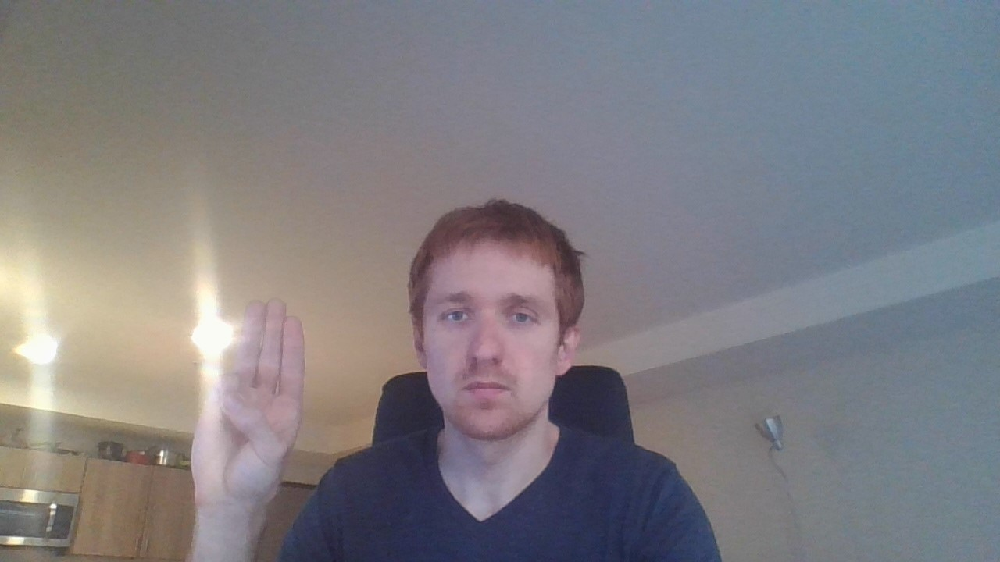
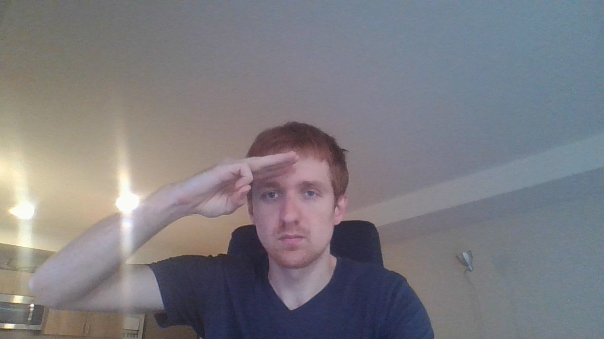
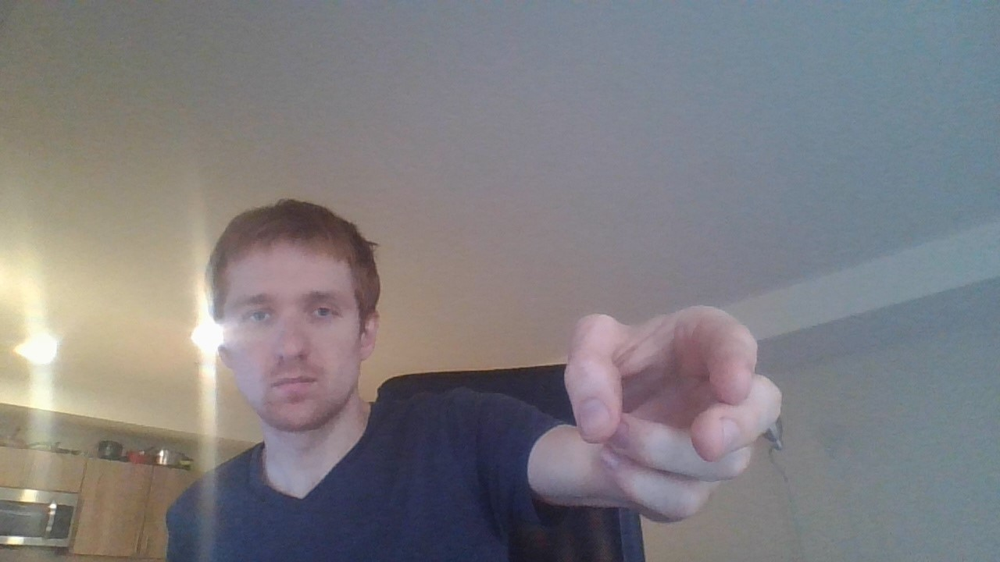

# Scout Rank Requirements

```
1a. Repeat from memory the Scout Oath, Scout Law, Scout motto, and Scout slogan. In your own words, explain their meaning.
```
* ✅ 4/8/2022 
  
[Video](./media/audio/scout-2f.m4a)

**Scout Oath**  
The Scout Oath is a commitment with three parts: to god and country, to others, and to oneself. The Scout commits to serve each to the best of his ability.

**Scout Law**  
The Scout Law is a list of twelve virtues that Scouts aim to uphold. Together, they outline a moral framework based off of virtue ethics.

**Scout Motto**  
 The motto, "Be prepared!" speaks both to the generally straightforward advice that planning and preparation are helpful to nearly all endeavors, as well as to the goal of Scouting as a youth organization to prepare youth for their adult life.

 **Scout Slogan**  
The Slogan, "Do a good turn daily," is a framework for putting the virtues Scout Law and Oath into practice in daily life to form a Scout's habits and character. While it is easiest to interpret the good turn as an act of helpfulness, it can be any act that deliberately demonstrates the values of the Oath and Law. A Scout should not simply do one good turn per day; he should look for opportunities each day.


```
1b. Explain what Scout spirit is. Describe some ways you have shown Scout spirit by practicing the Scout Oath, Scout Law, Scout motto, and Scout slogan.
```

Scout Spirit is living by the Scout Law, Oath, motto, and slogan in one's daily life.

*To do: focus on living with Scout Spirit*

```
1c. Demonstrate the Boy Scout sign, salute, and handshake. Explain when they should be used.
```
* ✅ 4/8/2022  

  
  
  

The Sign is used when reciting the Scout Oath or Law; or to signify a request for quiet attention from a group of scouts.

The Salute is used when honoring a flag, or similar ceremonial context, while in a Scout uniform.  

The handshake is used as a greeting between scouts, especially if both are in uniform.

*I anticipate that I will use these three gestures very rarely as a "Lone Wolf"*


```
1d. Describe the First Class Scout badge and tell what each part stands for. Explain the significance of the First Class Scout badge.
```
* ✅ 4/8/2022  

* The three points of the fleur-de-lis stand for the three parts of the Scout Oath.
* The eagle and shield stand for freedom and a Scout’s readiness to defend that freedom.
* The two stars on the badge symbolize truth and knowledge.
* The knot at the bottom of the scroll represents the Scout Slogan, “Do a Good Turn Daily”.
* The scroll bearing the Scout motto, “Be Prepared,” is turned up at the ends as a reminder that
a Scout smiles as he does his duty.

As an ensemble, these symbols represent the core principles of scouting.

```
1e. Repeat from memory the Outdoor Code. In your own words, explain what the Outdoor Code means to you.
```

```
1f. Repeat from memory the Pledge of Allegiance. In your own words, explain its meaning.
```

* ✅ 4/7/2022  

[Recording](./media/audio/scout-2f.m4a)

The Pledge is an expression of support for the United States as a nation and its foremost emblem, the flag. It references several values that are tied to the US's aspirational national identity: justice, liberty, piety, and unity.

National unity, especially when focused by aspirational values, can be a good catalyst for encouraging cooperation and trust between strangers, which is good for human well-being. 

*However, the Pledge is substantively an article of propaganda, and it shows its age.*

```
2a. Describe how the Scouts in the troop provide its leadership.
```

* ✅ 4/8/2022  

Youth Scout troops are organized into patrols, each with a leader. The Troop as a whole is led largely by a Senior Patrol Leader and a council of the patrol leaders. Adults, including the Scoutmaster, oversee and assist.

*In a way, my experience may be a maximal case of a scout-led troop, yet perhaps vacuously so, as "leading" only myself does not involve the challenges of communication, collaboration, and organization that are a valuable part of the youth Scout leader's experience.*


```
2b. Describe the four steps of Boy Scout advancement.
```

* ✅ 4/8/2022 

  * Learn
  * Test
  * Review
  * Recognition

*While following this curriculum alone, I'll have to use my own judgement as to when I've completed a requirement. As a guideline, I'll ask myself "is my mastery of this knowledge or skill at the level that I could use it for my own benefit (or the benefit of others, as appropriate), and could I comfortably teach it to others?"*

```
2c. Describe what the Boy Scout ranks are and how they are earned.
```

* ✅ 4/7/2022  

The BSA ranks are Scout, Tenderfoot, Second Class, First Class, Star, Life, and Eagle.

In youth Scouting groups, Scout ranks are earned by participating in troop activities, completing the requirements, getting sign-off from a leader, and for ranks above Scout, completing a board of review.

*In my individual project, I endeavor not to *earn* the ranks, but to gain the *experience*. However, to structure my efforts, I will use a similar approach of documenting my accomplishments.* 

```
2d. Describe what merit badges are and how they are earned.
```

```
3a. Explain the patrol method. Describe the types of patrols that are used in your troop.
```

* ✅ 4/8/2022  

In youth Scout troops, Scouts are grouped into patrols, often grouping scouts at similar stages of their journey in Scouting. Patrols are expected to establish small-group cohesion and shared responsibility.

In my individual experience, there is only one kind of patrol: me acting alone, or with ad-hoc groups of my friends and acquaintances.

```
3b. Become familiar with your patrol name, emblem, flag, and yell. Explain how these items create patrol spirit.
```


```
4a. Show how to tie a square knot, two half-hitches, and a taut-line hitch. Explain how each knot is used.
```

```
4b. Show the proper care of a rope by learning how to whip and fuse the ends of different kinds of rope.
```

```
5	Demonstrate your knowledge of pocketknife safety.
```

```
6	With your parent or guardian, complete the exercises in the pamphlet "How to Protect Your Children from Child Abuse: A Parents Guide" and earn the Cyber Chip Award for your grade. 1
```

```
7	Since joining the troop and while working on the Scout rank, participate in a Scoutmaster conference.
```

