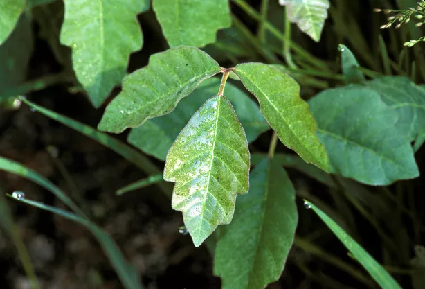

# Tenderfoot Rank Requirements

## Camping and Outdoor Ethics
```
1a.	Present yourself to your leader prepared for an overnight camping trip. Show the personal and camping gear you will use. Show the right way to pack and carry it.
```

```
1b.	Spend at least one night on a patrol or troop campout. Sleep in a tent you have helped pitch.
```

```
1c	Tell how you practiced the Outdoor Code on a campout or outing.
```

## Cooking
```
2a.	On the campout, assist in preparing one of the meals. Tell why it is important for each patrol member to share in meal preparation and cleanup.
```
```
2b.	While on a campout, demonstrate the appropriate method of safely cleaning items used to prepare, serve, and eat a meal.
```
```
2c.	Explain the importance of eating together as a patrol.
```
## Tools
```
3a	Demonstrate a practical use of the square knot.
```
```
3b	Demonstrate a practical use of two half-hitches.
```
```
3c	Demonstrate a practical use of the taut line hitch.
```
```
3d	Demonstrate proper care, sharpening, and use of the knife, saw, and ax. Describe when each should be used.
```


##	First Aid and Nature
```
4a	Show first aid for the following:
	Simple cuts and scrapes
	Blisters on the hand and foot
	Minor (thermal/heat) burns or scalds (superficial, or first degree)
	Bites or stings of insects or ticks
	Venomous snakebite
	Nosebleed
	Frostbite and sunburn
	Choking
```
* ✅ 4/14/2022

**Cuts and scrapes**  
Wash with soap and water; apply topical antibiotic and cover with a sterile bandage. *p.125*

**Blisters**  
Cover with moleskin or a bandage. Don't pop blisters unless necessary; but if they do pop, wash and treat like a minor cut: topical antibiotic and sterile bandage. *p.126*

**Minor burns and sunburns**  
Cover with cool water, but not ice. Treat with aloe vera. For sunburns, avoid further sun exposure *p.137*

**Insect Bites**  
* **Ticks**: Use tweezers to remove the tick, grabbing close to the skin. Then, wash with soap and water; apply antiseptic.
* **Chiggers**: Scrub with soap and water. Apply calamine lotion or hydrocortisone cream to relieve itching.
* **Spiders**: Wash the bite with soap and water. If there is significant swelling or other adverse reactions, ice the swelled area and seek immediate medical attention. 
* **Bee & Wasp Stings**: Remove the stinger by scraping it off; not with tweezers. Ice may help pain and swelling. Watch for signs of anaphylactic shock. *pp.131-132*

**Venomous Snakebite**  
Gently wash the wound site. Restrict movement of the affected limb; minimize movement as much as possible. Seek immediate emergency medical care; carry the victim if possible if relocation is required to reach medical care. Keep everyone calm and watch for signs of shock.

**Nosebleed**  
Firmly pinch the bridge of the nose and press the upper lip. If bleeding continues for more than 15 minutes, seek medical attention.


**Frostbite**  
Re-warm the affected area and prevent further exposure. Rather than using open flame for warmth, heat water instead. If fingers or toes are affected, separate them with gauze before bandaging. For serious cases, get medical help. *p.140*

**Choking**  
If the person is conscious, lean them over and hit them between the shoulder blades several times. If that doesn't work, stand behind them and perform several abdominal thrusts.

For an unconscious victim, check for an object in the mouth and remove it if found. Alternate 30 chest compressions and 2 rescue breaths until help arrives or breathing is restored. *p.121*


```
4b	Describe common poisonous or hazardous plants, identify any that grow in your local area or campsite location. Tell how to treat for exposure to them.
```
* ✅ 4/11/2022  

**Poison Ivy**  
*Toxicodendron radicans*
 
 Poison ivy is a vine that secretes the irritant chemical urushiol, which can cause skin rashes. Poison ivy typically has three leaves, each in the shape of a pointed oval with several "thumbs." 
 

   

**Poison Oak**  
*Toxicodendron diversilobum*
 
 Like poison ivy, poison oak secretes urushiol and can cause rashes. It also grows with leaves in clusters of three, and the leaves typically have "thumbs" that are more rounded than those of poison ivy.
 
 [Reference](https://thenaturecollective.org/plant-guide/details/poison-oak/)

 

**Poison Sumac**  
*Toxicodendron vernix*
 
 Like poison ivy and poison oak, poison oak secretes urushiol and can cause rashes. It has leaves with 7-13 leaflets, each in the shape of a smooth oval with a pointed tip; the color can vary by season.
 
 [Reference](https://www.thespruce.com/poison-sumac-pictures-4071931)

 

**Treatment**

For all three of these plants, the primary treatment is to wash off the irritant compound from the skin with soap and water. 

Topical corticosteroids (e.g. Cortisone) can be used to treat the allergic contact dermatitis caused by urushiol exposure.

[Reference](https://wa.kaiserpermanente.org/kbase/topic.jhtml?docId=hw74927&secId=hw74927-sec)

```
4c	Tell what you can do on a campout or other outdoor activity to prevent or reduce the occurrence of injuries or exposure listed in Tenderfoot requirements 4a and 4b.
```
* ✅ 4/18/2022

Cuts and Scrapes: general caution around sharp objects and terrain

Blisters: use well-fitting socks and shoes

Burns: Fire Hot! Bad! No Touchy!

Bug bites: use insect repellent; tuck pants into socks

Venomous snakebites: watch for likely hiding spots, spread brush with a hiking stick

Frostbite: Use adequate warm layers, stay dry

Sunburn: Sunscreen, hat, long-sleeve shirts

Choking: For me, chew thorouhly!

*Toxicodendron* family: avoid the bushes; minimize touching of pant legs and shoes

```
4d	Assemble a personal first-aid kit to carry with you on future campouts and hikes. Tell how each item in the kit would be used.
```
* ✅ 4/11/2022


This is an ultra-light first aid kid designed primarily for day hikes or one-night backpacking camping.

* Band-aids: for cuts, scrapes, and blisters  
* Alcohol prep pads: for cleaning wounds before bandaging.
* Neosporin: topical antibiotic ointment for preventing wound infection. 
* Tweezers: for removing thorns or ticks, etc.
* Ibuprofen: multi-purpose anti-inflamatory. Helps manage aches and pains.
* Bleed-stop: Coagulant powder to help staunch bleeding of major wounds.

*The earplugs and floss picks are not first-aid items, but I keep them with my first-aid supplies*

##	Hiking
```
5a	Explain the importance of the buddy system as it relates to your personal safety on outings and in your neighborhood. Use the buddy system while on a troop or patrol outing.
```
* ✅ 4/12/2022  

Hiking, espicially in back country, has some risk of injury. When hiking alone, I don't have anyone to assist or seek help if I am injured.

On April 10, I hiked in a group of 3; we stayed together as a group, in part to assist Alejandro with the difficult terrain.

```
5b	Explain what to do if you become lost on a hike or campout.
```
* ✅ 4/12/2022  


	* **S**tay Calm  
	* **T**hink - recall the route, consult map & compass
	* **O**bserve - Look for footprints, landmarks, trail markers, etc.
	* **P**lan - if moving on is a the best option, do so carefully to avoid getting further lost. Mark the path to allow backtracking.
```
5c	Explain the rules of safe hiking, both on the highway and cross-country, during the day and at night.
```

* ✅ 4/12/2022  

**Backcountry**
* Step carefully
* Watch for animals
* Have adequate water and other supplies
* Avoid crossing deep or fast-moving water
* Don't get lost

**Roads** 
* Walk so that you can see oncoming traffic
* Be visible at night with light clothing and a flashlight.


## Fitness
```
6a	Record your best in the following tests:						
	•	Pushups	(Record the number done correctly in 60 seconds)			
	•	Situps or curl-ups (Record the number done correctly in 60 seconds)			
	•	Back-saver sit-and-reach (Record the distance stretched)			
	•	1 mile walk/run	(Record the time)		
```	
* ✅ 4/7/2022  

| Push-ups  | Sit-Ups    |  Mile Run |  Stretch |
|-----------|------------|-----------|----------|
| 17        |    14      |     7:07  | -11.5 in |
```
6b	Develop and describe a plan for improvement in each of the activities listed in Tenderfoot requirement 6a. Keep track of your activity for at least 30 days.
```
Plan:

On at least 30 days, practice sit-ups, push-ups, and stretching.

On at least 5 days, repeat the 1-mile run.

See [this sheet](./physical-activity/Tenderfoot.md) for details.

```						
6c	Show improvement (of any degree) in each activity listed in Tenderfoot requirement 6a after practicing for 30 days.		
  ```

## 	Citizenship
```
7a	Demonstrate how to display, raise, lower, and fold the U.S. flag.
```


```
7b	Participate in a total of one hour of service in one or more service projects approved by your Scoutmaster. Explain how your service to others relates to the Scout slogan and Scout motto.
```


## Leadership
```
8	Describe the steps in Scouting's Teaching EDGE method. Use the Teaching EDGE method to teach another person how to tie the square knot.
```

**Explain** what you will teach and talk through the steps .  
**Demonstrate** the skill and explain again.  
**Guide** the learner as they attempt the skill themselves one or more times.  
**Enable** the learner to use the skill successfully on their own.


## Scout Spirit
```
9	Demonstrate Scout spirit by living the Scout Oath and Scout Law. Tell how you have done your duty to God and how you have lived four different points of the Scout Law in your everyday life.
```

```
10	While working toward Tenderfoot rank, and after completing Scout rank requirement 7, participate in a Scoutmaster conference.
```
* ✅ 4/17/2022

Discussed project progress with Dad 4/17

```
11	Successfully complete your board of review for the Tenderfoot rank.
```
