# Second Class Rank Requirements

## CAMPING and OUTDOOR ETHICS	
```
1a	Since joining Boy Scouts, participate in five separate troop/patrol activities, at least three of which must be held outdoors. Of the outdoor activities, at least two must include overnight camping. These activities do not include troop or patrol meetings. On campouts, spend the night in a tent that you pitch or other structure that you help erect, such as a lean-to, snow cave, or tepee.	
```

* ✅ 5/09/2022

**Camp-outs**
- Prentice Cooper - Apr 24 2022
- Mineral Bluff, GA - May 5-9 2022

**Activities**
- Hiking - Apr 10 2022
- Hiking - Apr 17 2022
- Hiking - Apr 30 2022


```
1b	Explain the principles of Leave No Trace, and tell how you practiced them on a campout or outing. This outing must be different from the one used for Tenderfoot requirement 1c.	
```
* ✅ 4/18/2022

Leave No trace:  
* plan ahead and prepare
* travel and camp on durable surfaces
* dispose of waste properly
* leave what you find
* minimize campfire impacts
* respect wildlife
* be considerate of other visitors

While hiking on Apr 10, we hiked on an established trail and packed all our snacks in and out. I was able to photograph some birds because we were quiet and they weren't bothered. 


```
1c	On one of these campouts, select a location for your patrol site and recommend it to your patrol leader, senior patrol leader, or troop guide. Explain what factors you should consider when choosing a patrol site and where to pitch a tent.	
```

* ✅ 4/24/2022  

I chose this campsite because:  
* It has an established fire ring
* It has a flat tent pad with packed ground and little vegetation, minimizing the risk of damaging the tent or crushing plants.
* The rocks are useful for sitting and cooking.
* It is close to a trail to a stream where water can be collected and filtered.


##	COOKING and TOOLS	
```
2a	Explain when it is appropriate to use a fire for cooking or other purposes and when it would not be appropriate to do so.	
```
* ✅ 4/18/2022

On public lands or without landowner permission otherwise, campfires should only be made when is possible to fully minimize the impact. This means using an existing fire ring or a surface the fire won't stain; when firewood can be sourced from dead and fallen branches; and when weather conditions are not too dry or windy that campfire embers pose a risk of igniting nearby vegetation.

```
2b	Use the tools listed in Tenderfoot requirement 3d to prepare tinder, kindling, and fuel wood for a cooking fire.	
```

* ✅ 5/13/2022

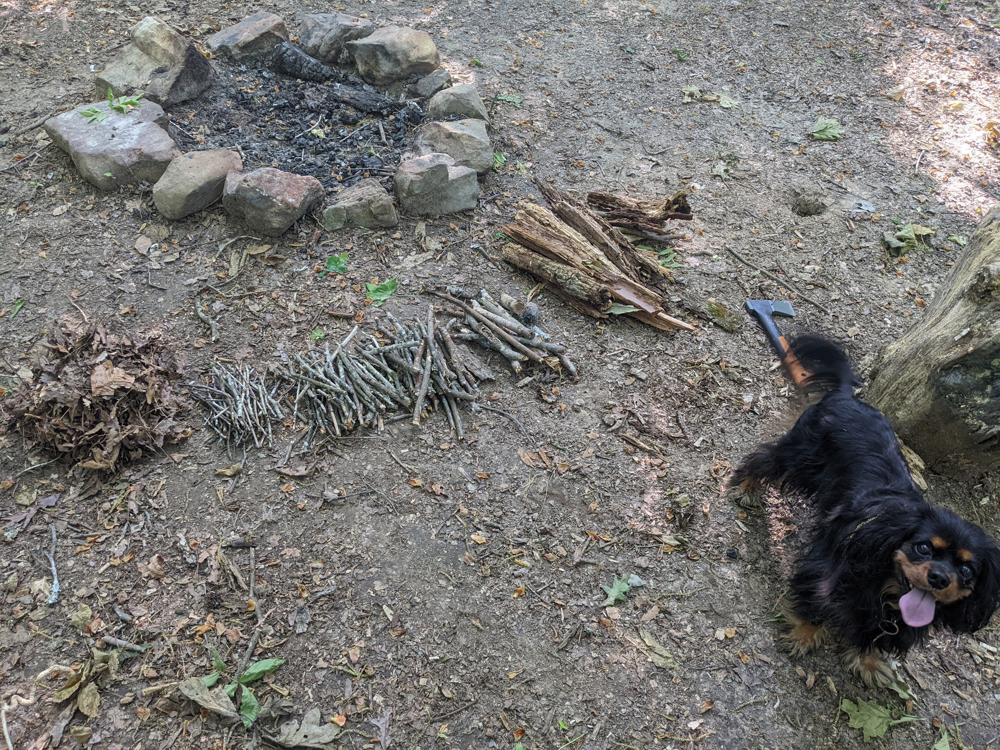

```
2c	At an approved outdoor location and time, use the tinder, kindling, and fuel wood from Second Class requirement 2b to demonstrate how to build a fire. Unless prohibited by local fire restrictions, light the fire. After allowing the flames to burn safely for at least two minutes, safely extinguish the flames with minimal impact to the fire site.	
```

* ✅ 5/13/2022

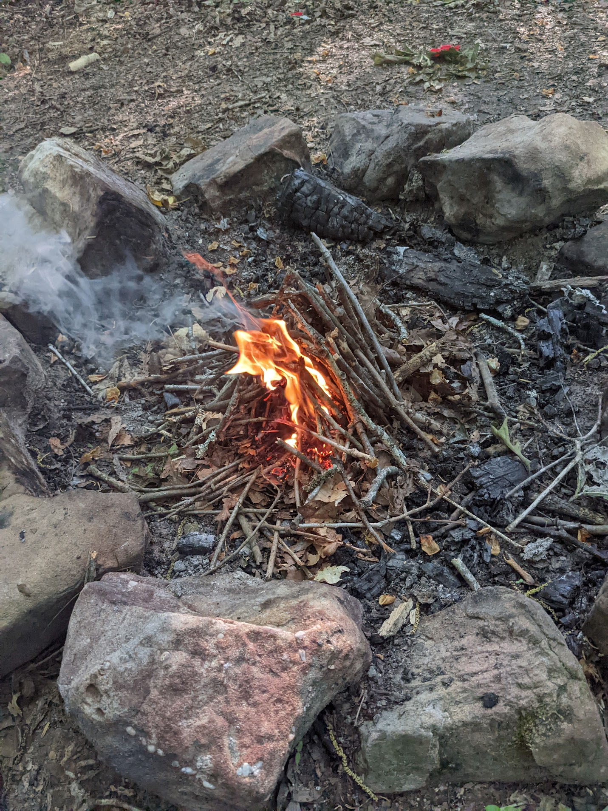

```
2d	Explain when it is appropriate to use a lightweight stove and when it is appropriate to use a propane stove. Set up a lightweight stove or propane stove. Unless prohibited by local fire restrictions, light the stove. Describe the safety procedures for using these types of stoves.	
```
* ✅ 4/24/2022  

Lightweight stove and large propane stoves are both acceptable in many situations, but lightweight stoves are clearly preferable for backpacking or hike-in camping. Large camp stoves are often fueled by propane, and they can offer easier cooking, especially for skillets and large pots. Butane may not vaporize and ignite at temperatures below freezing or at altitudes above 5000' - Propane or propane/butane mixed fuel is required in these situations.

To operate one of these stoves, set them up on a solid, flat surface away from combustible materials. Turn on the gas to low, then light the stove. If the stove does not ignite quickly, turn off the gas and let the fuel disperse before trying again. Be careful, it's hot! Let the stove cool completely before packing it up.

I cooked dinner and breakfast over my stove on Apr 23-24

```
2e	On one campout, plan and cook one hot breakfast or lunch, selecting foods from MyPlate or the current USDA nutritional model. Explain the importance of good nutrition. Demonstrate how to transport, store, and prepare the foods you selected.	
```
* ✅ 5/08/2022 


I cooked eggs and sausages for breakfast. Both are high in protein, which is good for providing energy for activity throughout the day.

The sausages and eggs were refrigerated with ice in a cooler. *I could instead have brought unwashed eggs, which don't require refrigeration.*

*I didn't anticipate how the cooler turned into a mosh-pit of ice, water, and food. Fortunately, these sausages were fully sealed, but in the future I'll need to isolate raw meat from all other food.*

```
2f	Demonstrate tying the sheet bend knot. Describe a situation in which you would use this knot.
```
* ✅ 4/13/2022  

 The sheet bend (here, tied with an additional backup knot) is a simple way to link the ends of two different ropes together. It is ideal for joining ropes of unequal size and/or stiffness. The thicker or stiffer rope makes only a single bight which the smaller rope passes through.

 For ropes of similar thickness and stiffness, the double fisherman's bend or figure-eight bend are more secure but not quite as easy to tie.


```
2g	Demonstrate tying the bowline knot. Describe a situation in which you would use this knot.	
```
* ✅ 4/13/2022  

A bowline is an easy-to-tie loop that is tied using one end of a rope. I use the double bowline to tie in to a harness when climbing outdoors because a bowline is easier to untie than a figure-eight loop after shock loading (though this very fact makes the figure-eight loop preferred by some climbers). 


##	NAVIGATION 
```
3a	Demonstrate how a compass works and how to orient a map. Use a map to point out and tell the meaning of five map symbols.	
```
* ✅ 4/18/2022 

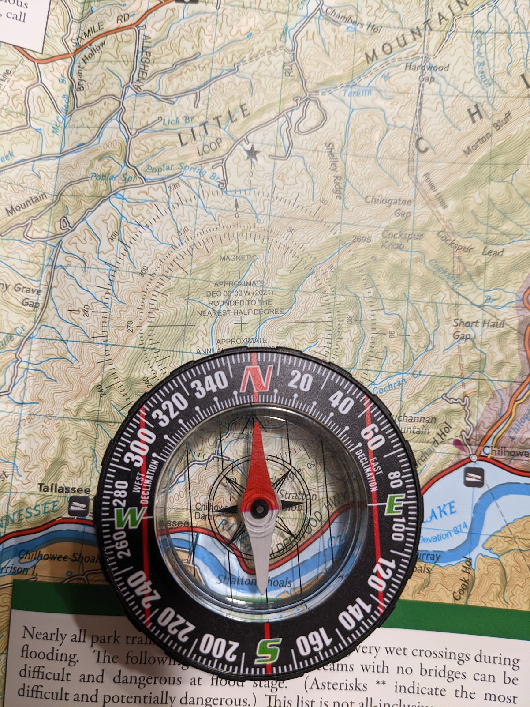

Based on where you are, magnetic north may not exactly match geographic north. High-quality trail maps may include the declination to adjust a compass to true north (pictured: 6 degrees west)

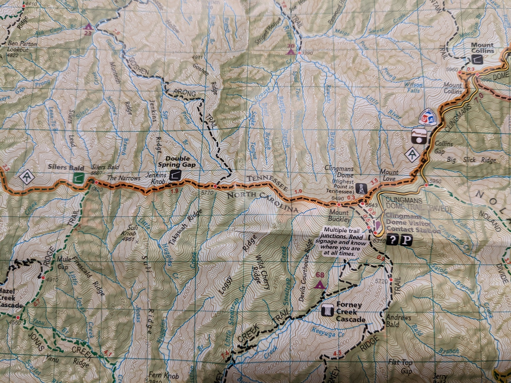

From left to right:
* "AT" in a white diamond: Appalachian Trail blaze
* Green square: shelter that accommodates horses
* Same symbol in black square: shelter that does not allow horses.
* (purple tent) Campsite for backpackers
* Waterfall
* Watchtower
* Information Center 
* Parking lot


```
3b	Using a compass and map together, take a five-mile hike (or 10 miles by bike) approved by your adult leader and your parent or guardian.
```
* ✅ 4/30/2022 

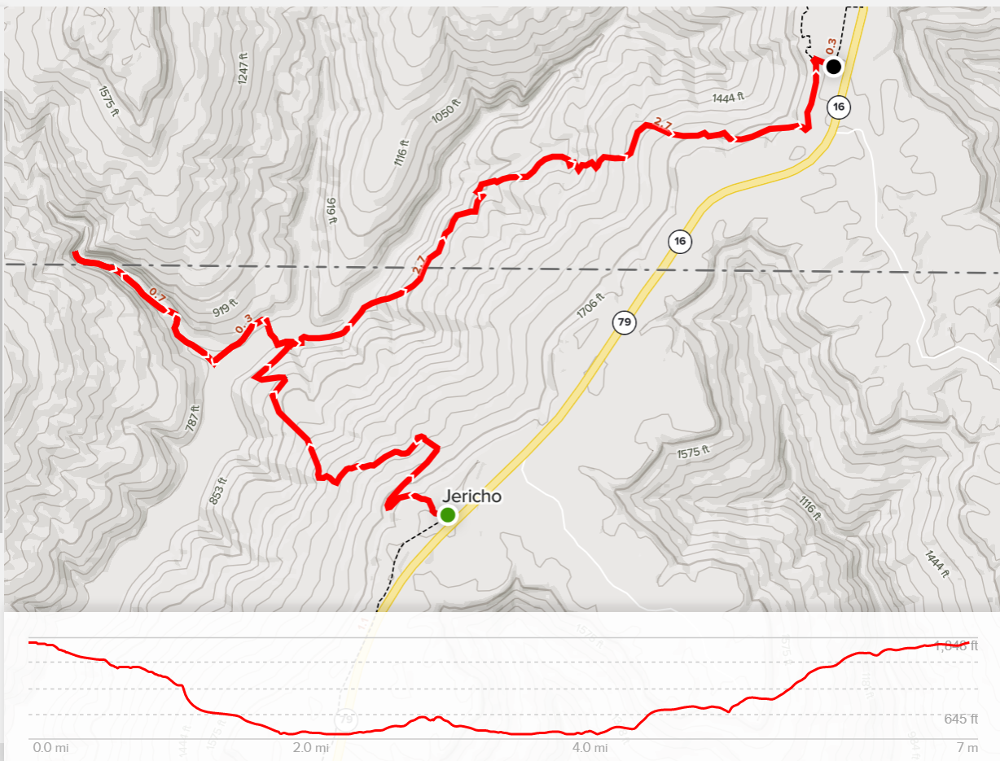

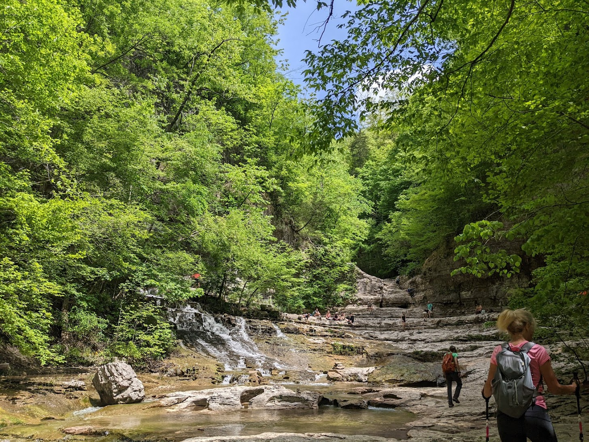

*I met a group of Scouts from Troop 14 while having lunch in the basin!*


```
3c	Describe some hazards or injuries that you might encounter on your hike and what you can do to help prevent them.	
```
* ✅ 4/30/2022 

* Joint injuries - ankle, knee, hip, etc.: Step carefully and at a safe pace for the terrain. Don't carry an overloaded pack. Use a walking stick if helpful.

* Water: Don't cross fast-moving water that's more than knee-deep. When crossing even shallow water, use a walking stick to improve balance. When wading through water, unbuckle backpack straps. 


```
3d	Demonstrate how to find directions during the day and at night without using a compass or an electronic device.	
```
* ✅ 7/15/2022 

*All of this applies to middle latitudes of the northern hemisphere only.*

**Day**:

The sun sets in the west and rises in the east.

To determine direction during midday, hold an analog watch with the hour hand facing the sun. The vector halfway between 12:00 and the hour hand points south. In this example, south is at approximately 2:30. During daylight savings time, use the angle bisector from 1:00 instead.

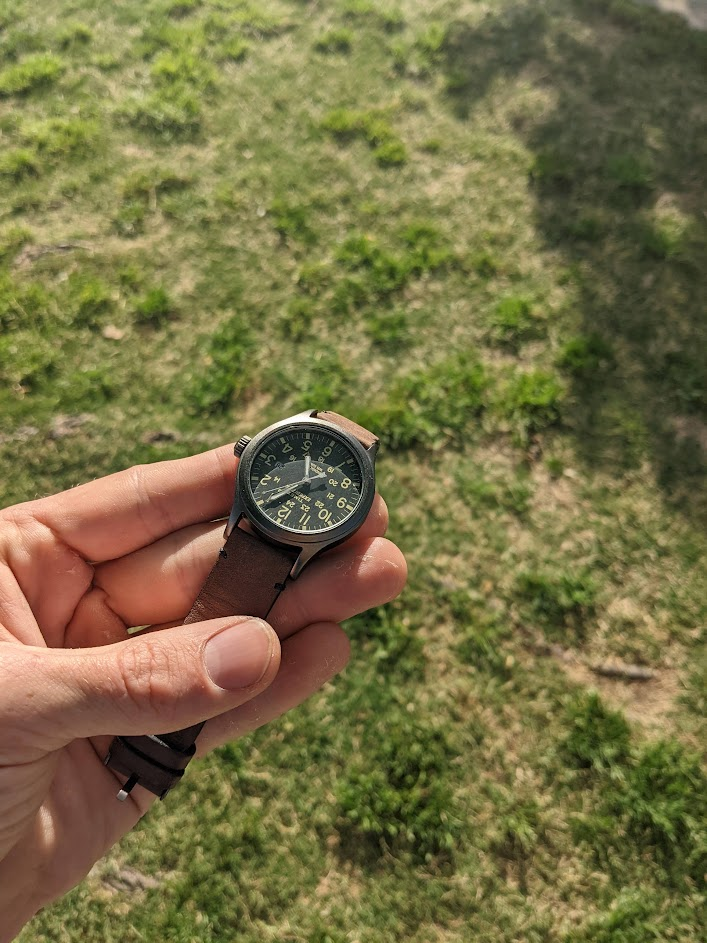

**Night**

* Stars method:

Locate the Big Dipper or Little Dipper in the sky, then find Polaris, the North Star. It is the handle of the little dipper, or approximately five "scoops" from the big dipper.

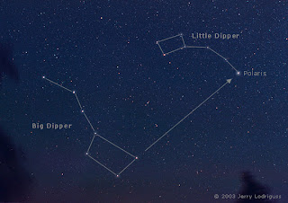

* Moon method

Like the sun, the moon rises in the East and sets in the West, passing through the Southern sky. The full moon rises at sunset, but time of moonrise cycles through the day with the phase of the moon.

It the moon is high in the sky, it is generally in the south quadrant of the sky. To determine if a non-full moon low in the sky is rising or setting, look at the angle of the line between the poles of the moon (i.e. the points of a crescent moon). That line will intersect the horizon in the south quadrant of the sky. 

This method is not very precise without correction for latitude and season, but can be helpful to provide a rough sense of direction. If celestial navigation is expected to be required for a trip (say, in an area without landmarks and with unmapped magnetic interference), it's possible to prepare in advance charts that will specify the sun and moon's position in the sky at each hour of the trip's dates.

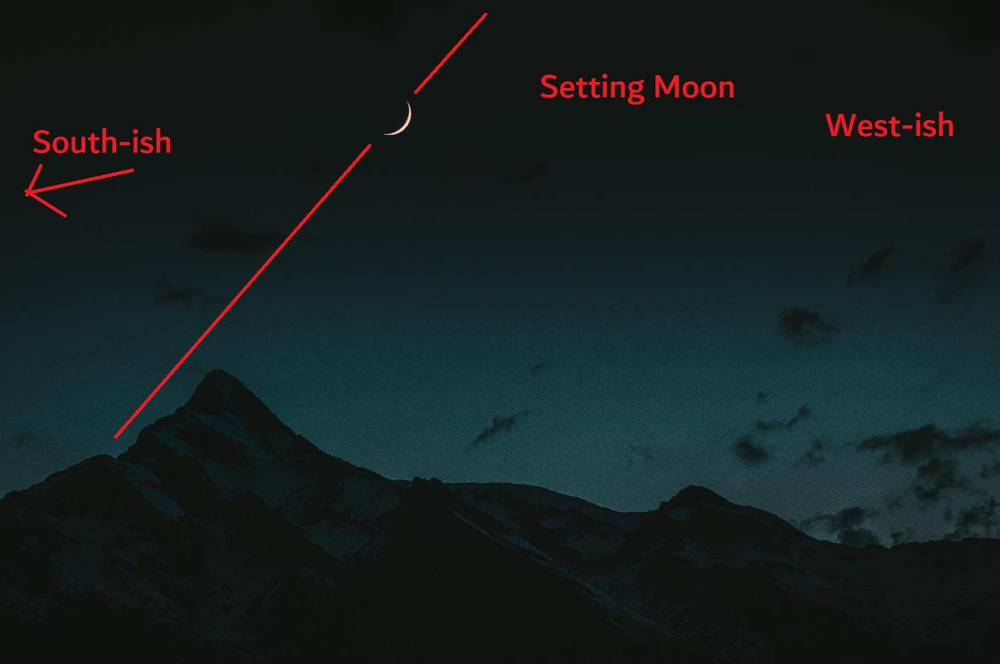


##	NATURE	

```
4	Identify or show evidence of at least ten kinds of wild animals (such as birds, mammals, reptiles, fish, mollusks) found in your local area or camping location. You may show evidence by tracks, signs, or photographs you have taken.
```

### Apheloria virgineinsis

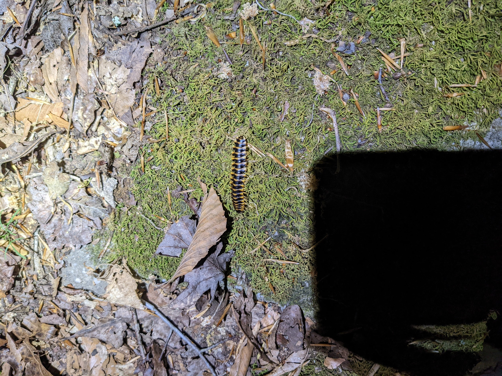

### Cottontail rabbit


### A dead fish

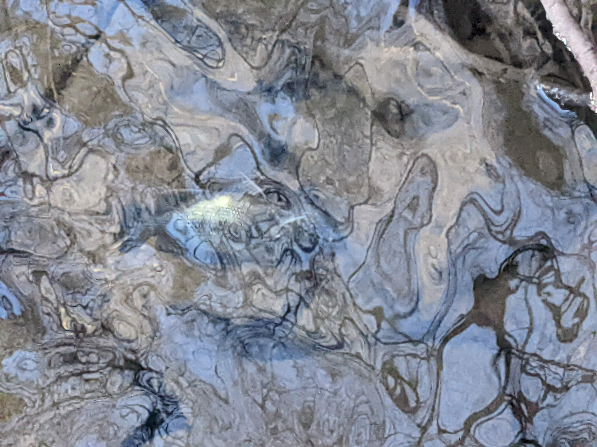

### White-tail deer

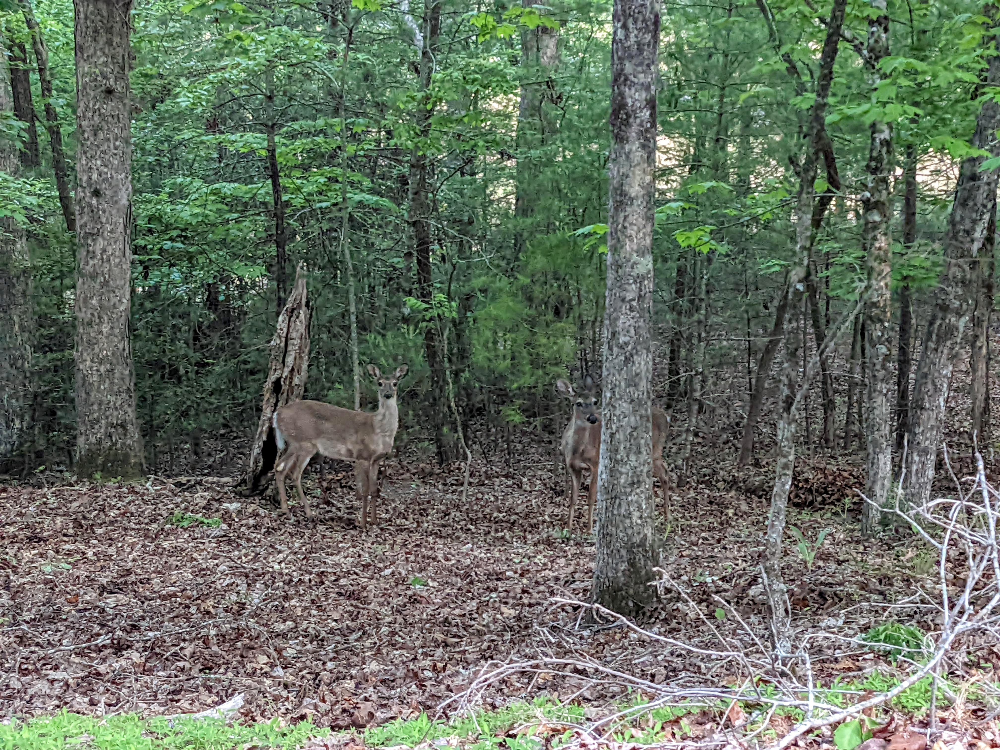

### Duck

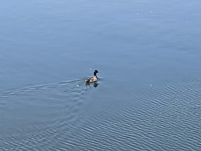

### Eastern box turtle

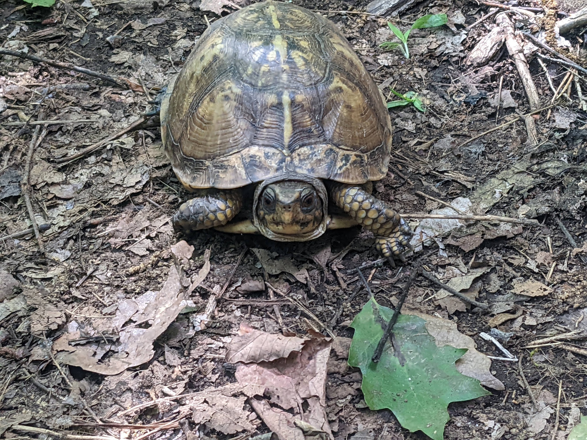

### Red-wing blackbird

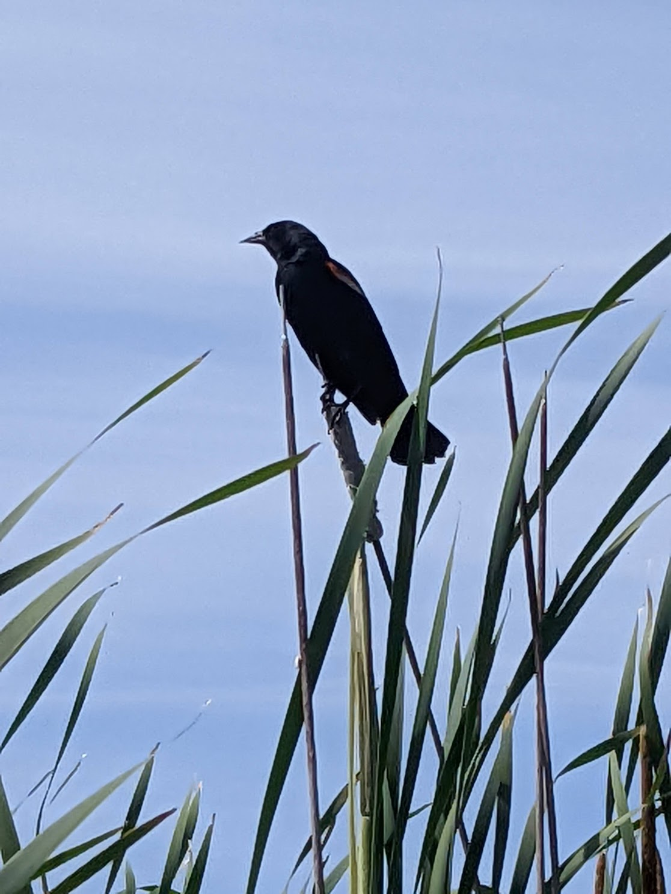

### Ring-neck snake

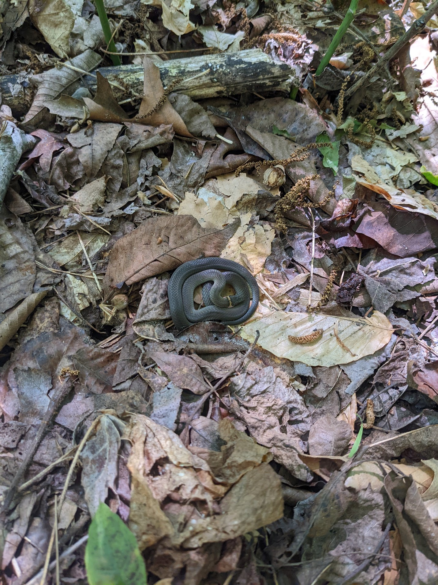

### A Toad

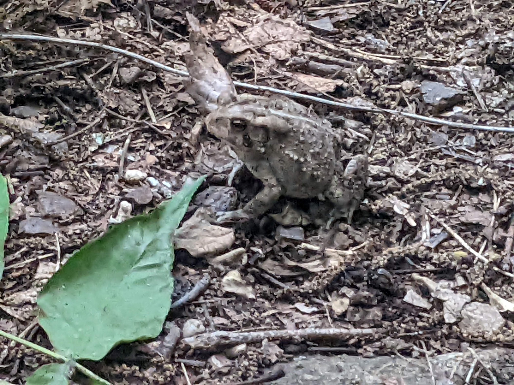

### Woodpecker

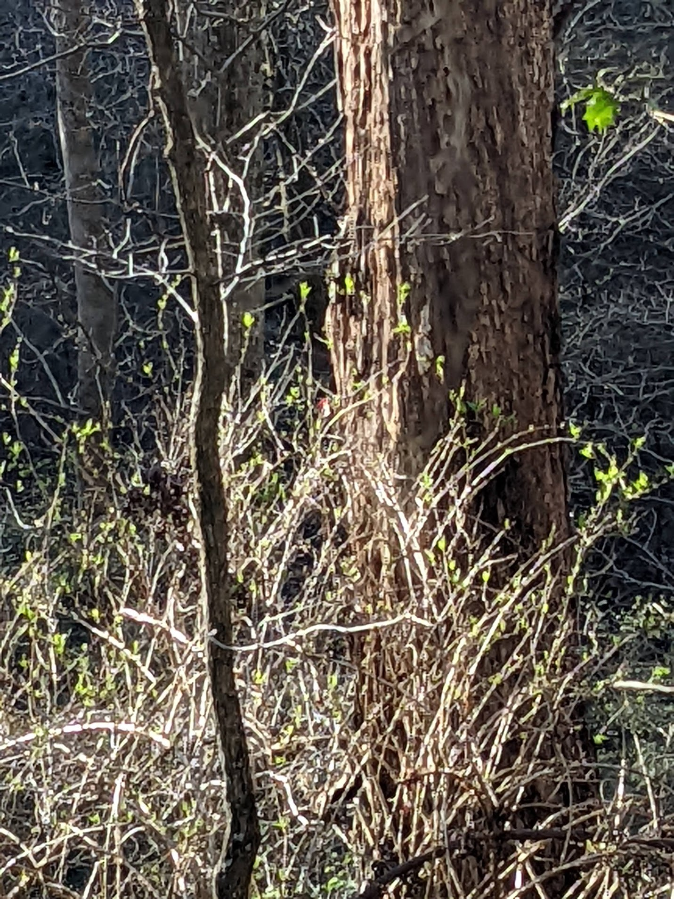

##	AQUATICS	
```
5a	Tell what precautions must be taken for a safe swim.	
```
* ✅ 4/30/2022 

These are the rules for swimming with youth:
* Qualified supervision of minors is required
* Swimmers must be healthy enough for swimming
* The water must be safe, clean, warm enough, etc.
* Lifeguards are required.
* An additional lookout is required
* Youth should swim in areas and activities appropriate for their ability level.
* Use a buddy system
* Maintain Discipline

*I, however, get to disregard all of these rules and replace them with simply "use good judgement." I will swim alone in conditions where I'm confident in my own safety.*


```
5b	Demonstrate your ability to pass the BSA beginner test. Jump feetfirst into water over your head in depth, level off and swim 25 feet on the surface, stop, turn sharply, resume swimming, then return to your starting place.	
```

* ✅ 5/28/2022 

Completed while swimming with Alejandro at Red Bank public pool.

*The nachos were delicious.*

```
5c	Demonstrate water rescue methods by reaching with your arm or leg, by reaching with a suitable object, and by throwing lines and objects.
```
* ✅ 6/03/2022   

_

* Reaching (body): Reach into the water from the edge or shallows.  
* Reaching (object): Use a stick, paddle, or similar object.
* Throwing (object): Throw something that floats, such as a buoy, life jacket, life jacket, paddle, or cooler.
* Throwing (rope): Coil rope in an outward-facing coil, then throw one end of it past the victim

```
5d	Explain why swimming rescues should not be attempted when a reaching or throwing rescue is possible. Explain why and how a rescue swimmer should avoid contact with the victim.	
```

* ✅ 6/03/2022 

Drowning people will impulsively grab a rescue swimmer, which can endanger both of them. Reaching and throwing rescues don't present the same risk to the rescuer. 

When making a swimming rescue, the rescue swimmer should bring a flotation device to the victim.

##	FIRST AID	
```
6a	Demonstrate first aid for the following:	
	Object in the eye	
	Bite of a warm blooded animal	
	Puncture wounds from a splinter, nail, and fishhook	
	Serious burns (partial thickness, or second degree)	
	Heat exhaustion	
	Shock	
	Heatstroke, dehydration, hypothermia, and hyperventilation	
```
* ✅ 5/27/2022 

* **Object in Eye**

Don't the eye. Blink rapidly, or flush with clean water. Another person can help keep the eyelids open. If the object can't be removed, get medical attention.

* **Bite of a warm blooded animal**

Wash with soap and water. Flush with clean water for several minutes. Control any bleeding, then bandage. Seek medical attention.

* **Puncture wounds**

For small objects such as thorns or splinters, remove them and wash the skin around the wound, but don't flush with water. Bandage with antibiotic ointment.

For large objects, such as anything larger than a small nail, don't remove the object until after seeking medical care.

* **Serious burns**

For second-degree burns, clean the wound with clean water, but don't apply any other substances. Once dry, cover with clean cloth or gauze. 

For third degree burns, keep the wound dry. Cover with clean cloth or gauze and seek medical attention. Keep the victim calm and watch for signs of shock.

* **Heat exhaustion**

Rest in a cool, shady place. Cool down by removing excess clothing or wet cloths. Drink plenty of water. If symptoms don't improve quickly, get medical help.

*I was able to help my friend Ale recover from heat exhaustion when we hiked out to Foster Falls.*

* **Shock**

Have the person lay down with their legs elevated. If someone is unconscious and breathing, but severe internal injuries are not likely, have them lay on their side. Keep the victim warm.

* **Heatstroke**

Heatstroke has symptoms like heat exhaustion, but also has elevated pulse, shallow breathing, confusion, disorientation, or unconsciousness, vomiting, or seizures.

Get emergency medical attention while treating with the same methods as for heat exhaustion. Use ice packs or a shallow body of water, if available. Don't give fluids to an unconscious person.

* **Dehydration**

Treating dehydration is easy: drink more water.

Signs of dehydration include thirst, dark urine, exhaustion, dry skin and lips, nausea, fainting, loss of appetite, headaches, cramps, confusion and/or dizziness.

* **Hypothermia**

Get the person warm and dry- Use blankets, jackets, and sleeping bags. If the person is able, have them drink warm liquids, such as soup. Avoid caffeinated drinks.

* **Hyperventilation**

Encourage the victim to stay calm and to take take slow, shallow breaths- one breath every five seconds.

```
6b	Show what to do for "hurry" cases of stopped breathing, stroke, severe bleeding, and ingested poisoning.	
```

* ✅ 6/03/2022 

* Stopped breathing: Direct a specific person to call 911. Use an AED if one is available. Give 30 chest compressions then 2 rescue breaths; alternating until help arrives, the victim shows signs of life, or exhaustion. If head/neck/spine injury is suspected, do not give rescue breaths.

* Stroke: Signs of stroke include sudden, otherwise-unexplained onset of any of the following: numbness or weakness of a part of the body, confusion, dizziness, loss of coordination or balance, difficulty speaking or understanding, or headache. If the person cannot move their face, arms, or speak clearly, call 911.

* Severe bleeding: Direct a specific person to call 911. Cover the wound with cloth and apply pressure. Bind with a pressure wrapping tha does not cut off circulation. Add additional bandages as needed; don't remove soaked bandages.

* Poisoning - swallowed: Call 911 or poison control. Treat for shock; perform CPR if breathing stops. Rolling the person onto their side to prevent vomit or saliva from threatening choking. Don't attempt to induce vomiting.

* Poisoning - inhaled: Ensure the area is safe for those providing assistance. Move the victim to fresh air, then seek medical help. Check for breathing and preform CPR if breathing stops.

```
6c	Tell what you can do while on a campout or hike to prevent or reduce the occurrence of the injuries listed in Second Class requirements 6a and 6b.	
```
* ✅ 6/03/2022 

* **Object in Eye** - Don't follow closely behind another hiker who is pushing through overhanging brush - it can swing back into your face.

* **Bite of a warm blooded animal** - Leave the animals alone! Most of the risk of a bite is caused by an animal that feels threatened or trapped.

* **Puncture wounds** - Wear sturdy footwear, especially in areas that may have broken glass or nails.

* **Serious burns** - Fire bad, no touchy! Move carefully around campfires, and keep the area around fire rings clear of tripping hazards.

* **Dehydration, Heat exhaustion and Heatstroke** - Pack and drink enough water

* **Hypothermia** - Stay warm and dry in cold weather.

* **Severe bleeding** - Be careful with sharp tools. With knives, only cut away from your body.

* **Poisoning** - Don't eat anything you find outdoors. (And besides, leave no trace!)


```
6d	Explain what to do in case of accidents that require emergency response in the home and the backcountry. Explain what constitutes an emergency and what information you will need to provide to a responder.	
```

* ✅ 6/27/2022 

An emergency situation is when immediate action is required to protect life and health.

When responding to emergency, the best response is to stay calm, triage, plan, send for help, and to take the steps required to address the most important issues first.

These kinds of information are most useful for first responders:

* Nature of emergency
* Location and contact information
* Description of any injuries
* When the injuries occurred
* Any treatments already given
* What resources are available on the scene of the emergency, including equipment, people, and specialized skills.
* That resources are needed 


```
6e	Tell how you should respond if you come upon the scene of a vehicular accident.	
```
* ✅ 6/27/2022 

Before providing first aid, make the scene as safe as possible:
 
 * Isolate the vehicle from traffic using cones, flares, or another vehicle.
 * Turn off the engine.
 * Secure the parking brake if the vehicle is on an incline.

If the scene cannot be made safe, don't endanger yourself attempting to provide aid.

## FITNESS	
```
7a	After competing Tenderfoot requirement 6c, be physically active at least 30 minutes a day for five days a week for four weeks. Keep track of your activities.	
```
* ✅ 6/28/2022 

See [this page](./physical-activity/Second-Class.md) for the activity log

```
7b	Share your challenges and successes in completing Second Class requirement 7a. Set a goal for continuing to include physical activity as part of your daily life and develop a plan for doing so.	
```

* ✅ 7/3/2022 

It took me a span of six weeks to finish this requirement, mainly because of the disruption to my schedule caused by traveling to Texas and Wisconsin on back-to-back weeks. I typically get outdoors most weekends, but don't consistently get exercise on weeknights.

As I continue tracking weekly activity for First Class, I want to focus on getting active on weeknights more consistently, such as by getting out to to the gym twice a week rather than only once.

```
7c	Participate in a school, community, or troop program on the dangers of using drugs, alcohol, and tobacco, and other practices that could be harmful to your health. Discuss your participation in the program with your family, and explain the dangers of substance addictions. Report to your Scoutmaster or other adult leader in your troop about which parts of the Scout Oath and Law relate to what you learned.	
```
* ✅ 7/15/2022 

I've had a series of conversations with a close friend of mine about his experience of falling into and recovering from addiction to various stimulant drugs. He described a familiar situation in which drug use led to the contracting of his social circle until his only close associates were other drug abusers. We also discussed how psychedelic drugs can permanently change a person's mind, even with only a single use.

I connect this to the concept of **goal-content integrity** as highlighted by Nick Bostrom in his writings about the behavior of rational super-intelligent agents. He suggests that goal-content integrity is something that a rational agent would consider to be as important as self-preservation. If something can change what your goals are, it's rational to avoid that thing, *even if you believe you would be happier after changing goals*. This, to me, is part of what it means to stay "mentally awake." 


##	CITIZENSHIP	
```
8a	Participate in a flag ceremony for your school, religious institution, chartered organization, community, or Scouting activity.	
``` 

* ✅ 5/28/2022 

As a volunteer alongside dozens of Scouts from across the region, I placed flags at servicemembers' graves at Chattanooga National Cemetary. 

*As I anticipated when I started this project, satisfying this requirement involves a slight bend for the sake of feasibility.*

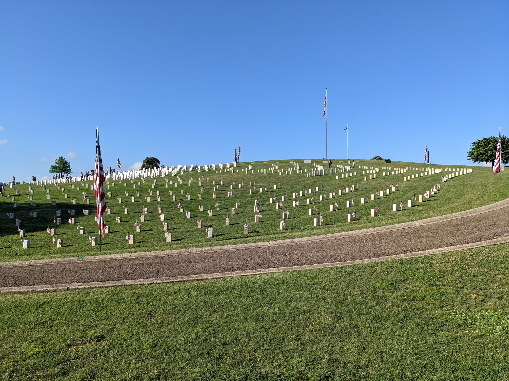


```
8b	Explain what respect is due the flag of the United States.	
```

* ✅ 6/27/2022 
  
----

* Remove hat and stand at attention with right hand over heart when the flag is being raised or lowered, is passing you, you pass it, and during the national anthem. When in an appropriate uniform (such as a Scouting uniform), salute instead.

* When flying the American flag with other flags, if should be on its own flagpole, at least as tall as any other, furthest to the viewer's left or in front. The American flag is raised first and lowered last. 

* The flag should be properly lit when flown overnight. Otherwise, it should be flown between sunrise and sunset.

* When worn on a uniform, the flag is placed on the right sleeve near the shoulder.

* Don't display flags that are faded or tattered. Instead, retire them by burning them to ash in a fire.


```
8c	With your parents or guardian, decide on an amount of money that you would like to earn, based on the cost of a specific item you would like to purchase. Develop a written plan to earn the amount agreed upon and follow that plan; it is acceptable to make changes to your plan along the way. Discuss any changes made to your original plan and whether you met your goal.	
```
* ✅ 6/17/2022 

### Plan

I have been tracking my monthly budget for a number of years now, mostly to keep control of how much I spend on discretionary shopping, entertainment, and meals. As a regular-full-time salaried employee, my income is largely inelastic, but how much of that I keep to save and invest is definitely in my control.

My Phiaton wireless headphones are several years old and still functional, but they don't fit very comfortably anymore because the foam padding has collapsed. I'm considering replacing them. I anticipate this could cost somewhere between $100 to $250, depending on what I buy.

I'll earmark $100 per month from my general discretionary budget to a separate line item for saving for large electronics purchases, such as new headphones.


```
8d	At a minimum of three locations, compare the cost of the item for which you are saving to determine the best place to purchase it. After completing Second Class requirement 8c, decide if you will use the amount that you earned as originally intended, save all or part of it, or use it for another purpose.
```
* ✅ 6/17/2022 

Here are the options I considered for new noise-cancelling bluetooth headphones:

### Comparison
| Model | Vendor | Price |
| --- | --- | ---|
| Sennheiser HD 450BT | Amazon.com | $150 |
| Bose QuietComfort 45 | Bose | $279 |
| Jabra Elite 45h | Amazon.com |  $99 

### Results

After saving $200 from two months' budget, I'm here in the Atlanta airport wearing my old headhones, and I've realized they can hold out a little bit longer. I'm going to use the funds I've saved towards the flights for my trip to the grand canyon this fall.

```
8e	Participate in two hours of service through one or more service projects approved by your Scoutmaster. Explain how your service to others relates to the Scout Oath.	
```

* ✅ 5/15/2022 

I helped at a creek cleanup for Wild Trails. Using paddleboards, Alejandro and I together collected about a dozen large bags of trash. We found a lifelike mannequin head (with hair!) that looked startlingly grisly floating in the creek.

A project like this fulfills the Oath's duty to the country by protecting the health and safety of this urban water system, and also the promise to help others in contributing to a recurring group effort.

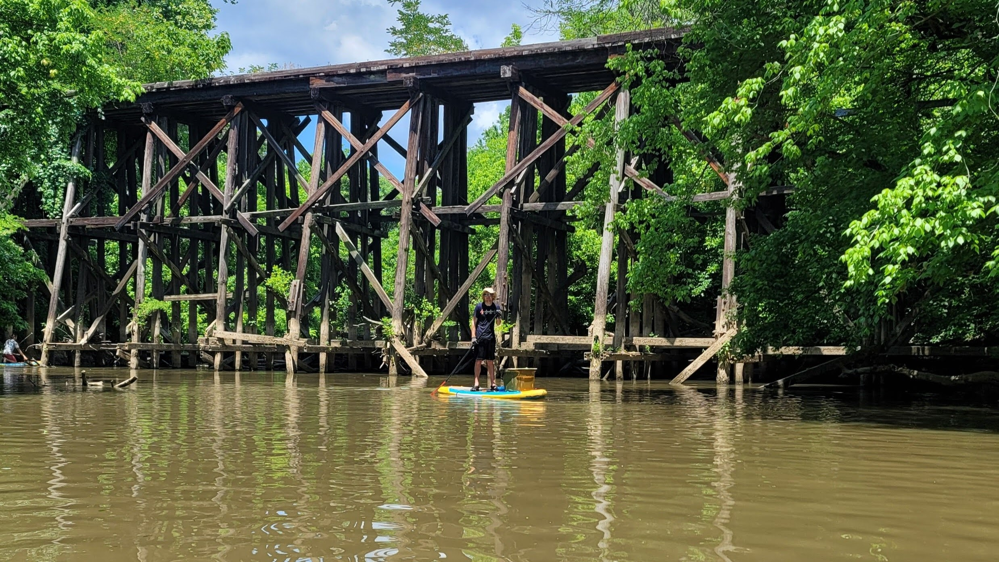

##	LEADERSHIP	
```
9a	Explain the three R's of personal safety and protection.	
```
* ✅ 6/27/2022 

Scouting trains its youth to **recognize** abuse, **respond** in the moment to protect themselves, and **report** it to adults.

*For me, this applies somewhat differently. On occasions I may interact with kids, I should be aware of best practices for preventing abuse, and should take action in response to information that may indicate abuse is occurring.*


```
9b	Describe bullying; tell what the appropriate response is to someone who is bullying you or another person.	
```

* ✅ 6/27/2022 

Bullying can take many forms, including verbal, social, and physical. It can occur one-on-one, in groups, or online.

Possible signs of bullying include symptoms of depression, avoidant social isolation or social anxiety, anger, or carrying a weapon for self-defence.

Adults have a responsibility to intervene to protect kids from bullying. The appropriate response strategies vary by situation, but have three main components:

* Communicate to the victim(s) that the bullying is not their fault and that you will act to prevent it from continuing.  
* Communicate to the bullies that their actions are not acceptable, are dishonorable, and may lead to consequences for them.
* Act to prevent further bullying. This can range from increased supervision to completely removing the bully from the situation.

Adults should communicate information about bullying to parents and other adults in the situation.

##	SCOUT SPIRIT	
```
10	Demonstrate scout spirit by living the Scout Oath and Scout Law. Tell how you have done your duty to God and how you have lived four different points of the Scout Law (not to include those used for Tenderfoot requirement 9) in your everyday life.	
```

```
11	While working toward the Second Class rank, and after completing Tenderfoot requirement 10, participate in a Scoutmaster conference.	
```

* ✅ 6/26/2022

Discussed project with Dad on 6/26. He suggests an online video or class for requirement 7c.

```
12	Successfully complete your board of review for the Second Class rank.	
```
