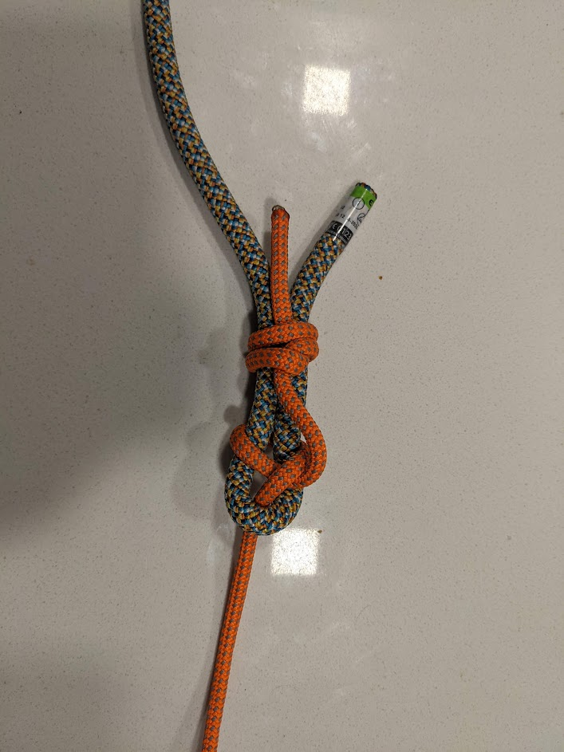
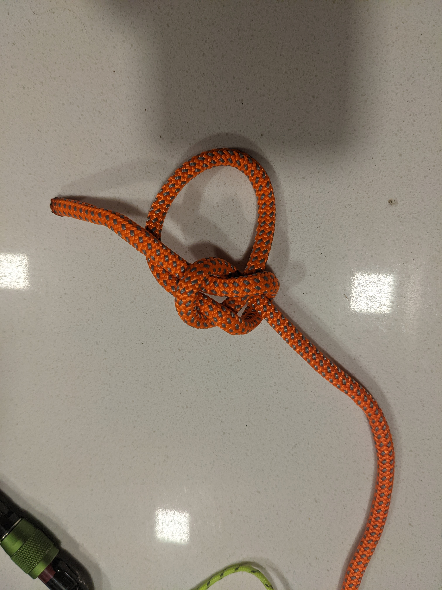
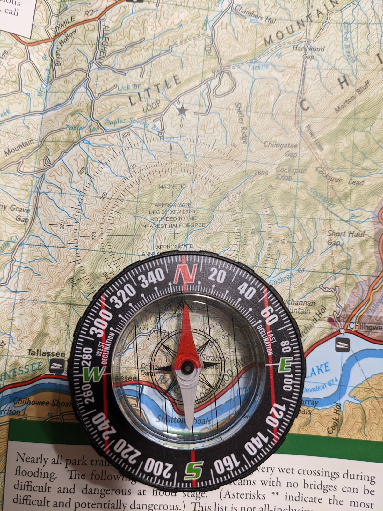
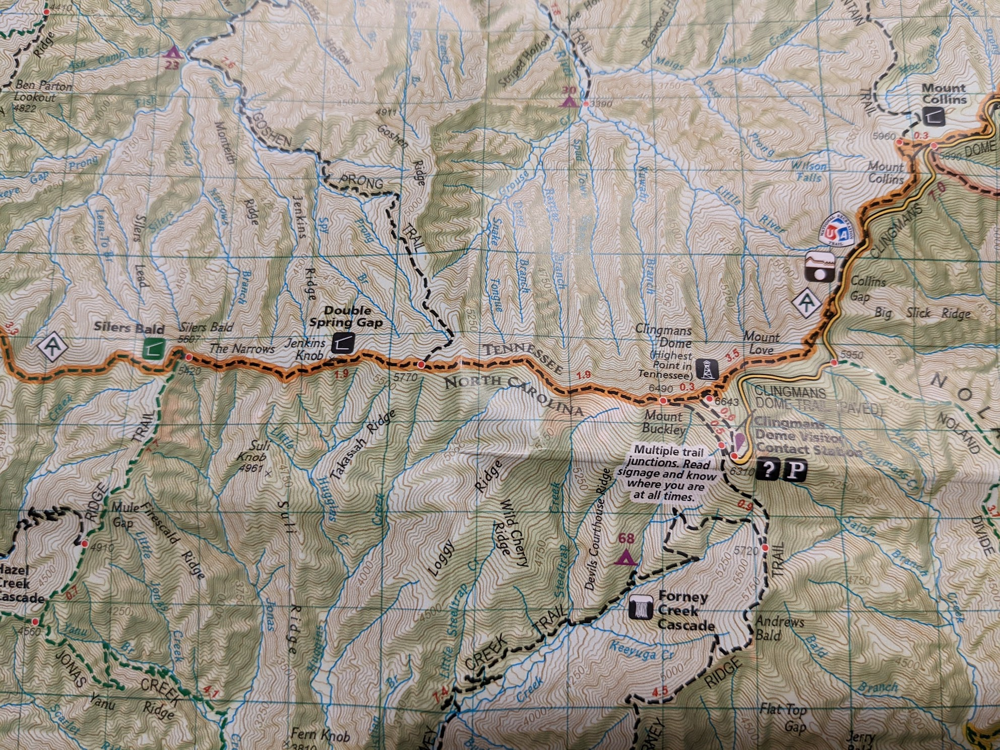

# Second Class Rank Requirements

## CAMPING and OUTDOOR ETHICS	
```
1a	Since joining Boy Scouts, participate in five separate troop/patrol activities, at least three of which must be held outdoors. Of the outdoor activities, at least two must include overnight camping. These activities do not include troop or patrol meetings. On campouts, spend the night in a tent that you pitch or other structure that you help erect, such as a lean-to, snow cave, or tepee.	
```
**Camp-outs**
- Prentice Cooper Apr 24 2022

**Activities**
- Hiking - Apr 10 2022
- Hiking - Apr 17 2022


```
1b	Explain the principles of Leave No Trace, and tell how you practiced them on a campout or outing. This outing must be different from the one used for Tenderfoot requirement 1c.	
```
* ✅ 4/18/2022

Leave No trace:  
* plan ahead and prepare
* travel and camp on durable surfaces
* dispose of waste properly
* leave what you find
* minimize campfire impacts
* respect wildlife
* be considerate of other visitors

While hiking on Apr 10, we hiked on an established trail and packed all our snacks in and out. I was able to photograph some birds because we were quiet and they weren't bothered. 


```
1c	On one of these campouts, select a location for your patrol site and recommend it to your patrol leader, senior patrol leader, or troop guide. Explain what factors you should consider when choosing a patrol site and where to pitch a tent.	
```

* ✅ 4/24/2022  

I chose this campsite because:  
* It has an established fire ring
* It has a flat tent pad with packed ground and little vegetation, minimizing the risk of damaging the tent or crushing plants.
* The rocks are useful for sitting and cooking.
* It is close to a trail to a stream where water can be collected and filtered.


##	COOKING and TOOLS	
```
2a	Explain when it is appropriate to use a fire for cooking or other purposes and when it would not be appropriate to do so.	
```
* ✅ 4/18/2022

On public lands or without landowner permission otherwise, campfires should only be made when is possible to fully minimize the impact. This means using an existing fire ring or a surface the fire won't stain; when firewood can be sourced from dead and fallen branches; and when weather conditions are not too dry or windy that campfire embers pose a risk of igniting nearby vegetation.

```
2b	Use the tools listed in Tenderfoot requirement 3d to prepare tinder, kindling, and fuel wood for a cooking fire.	
```

```
2c	At an approved outdoor location and time, use the tinder, kindling, and fuel wood from Second Class requirement 2b to demonstrate how to build a fire. Unless prohibited by local fire restrictions, light the fire. After allowing the flames to burn safely for at least two minutes, safely extinguish the flames with minimal impact to the fire site.	
```

```
2d	Explain when it is appropriate to use a lightweight stove and when it is appropriate to use a propane stove. Set up a lightweight stove or propane stove. Unless prohibited by local fire restrictions, light the stove. Describe the safety procedures for using these types of stoves.	
```
* ✅ 4/24/2022  

Lightweight stove and large propane stoves are both acceptable in many situations, but lightweight stoves are clearly preferable for backpacking or hike-in camping. Large camp stoves are often fueled by propane, and they can offer easier cooking, especially for skillets and large pots. Butane may not vaporize and ignite at temperatures below freezing or at altitudes above 5000' - Propane or propane/butane mixed fuel is required in these situations.

To operate one of these stoves, set them up on a solid, flat surface away from combustible materials. Turn on the gas to low, then light the stove. If the stove does not ignite quickly, turn off the gas and let the fuel disperse before trying again. Be careful, it's hot! Let the stove cool completely before packing it up.

I cooked dinner and breakfast over my stove on Apr 23-24

```
2e	On one campout, plan and cook one hot breakfast or lunch, selecting foods from MyPlate or the current USDA nutritional model. Explain the importance of good nutrition. Demonstrate how to transport, store, and prepare the foods you selected.	
```


```
2f	Demonstrate tying the sheet bend knot. Describe a situation in which you would use this knot.
```
* ✅ 4/13/2022  

 The sheet bend (here, tied with an additional backup knot) is a simple way to link the ends of two different ropes together. It is ideal for joining ropes of unequal size and/or stiffness. The thicker or stiffer rope makes only a single bight which the smaller rope passes through.

 For ropes of similar thickness and stiffness, the double fisherman's bend or figure-eight bend are more secure but not quite as easy to tie.




```
2g	Demonstrate tying the bowline knot. Describe a situation in which you would use this knot.	
```
* ✅ 4/13/2022  

A bowline is an easy-to-tie loop that is tied using one end of a rope. I use the double bowline to tie in to a harness when climbing outdoors because a bowline is easier to untie than a figure-eight loop after shock loading (though this very fact makes the figure-eight loop preferred by some climbers). 



##	NAVIGATION 
```
3a	Demonstrate how a compass works and how to orient a map. Use a map to point out and tell the meaning of five map symbols.	
```
* ✅ 4/18/2022 



Based on where you are, magnetic north may not exactly match geographic north. High-quality trail maps may include the declination to adjust a compass to true north (pictured: 6 degrees west)



From left to right:
* "AT" in a white diamond: Appalalachian Trail blaze
* Green square: shelter that accomodates horses
* Same symbol in black square: shelter that does not allow horses.
* (purple tent) Campsite for backpackers
* Waterfall
* Watchtower
* Information Center 
* Parking lot


```
3b	Using a compass and map together, take a five-mile hike (or 10 miles by bike) approved by your adult leader and your parent or guardian.
```


```
3c	Describe some hazards or injuries that you might encounter on your hike and what you can do to help prevent them.	
```


```
3d	Demonstrate how to find directions during the day and at night without using a compass or an electronic device.	
```
##	NATURE	

```
4	Identify or show evidence of at least ten kinds of wild animals (such as birds, mammals, reptiles, fish, mollusks) found in your local area or camping location. You may show evidence by tracks, signs, or photographs you have taken.
```

##	AQUATICS	
```
5a	Tell what precautions must be taken for a safe swim.	
```
```
5b	Demonstrate your ability to pass the BSA beginner test. Jump feetfirst into water over your head in depth, level off and swim 25 feet on the surface, stop, turn sharply, resume swimming, then return to your starting place.3	
```

```
5c	Demonstrate water rescue methods by reaching with your arm or leg, by reaching with a suitable object, and by throwing lines and objects.
```

```
5d	Explain why swimming rescues should not be attempted when a reaching or throwing rescue is possible. Explain why and how a rescue swimmer should avoid contact with the victim.	
```
##	FIRST AID	
```
6a	Demonstrate first aid for the following:	
	Object in the eye	
	Bite of a warm blooded animal	
	Puncture wounds from a splinter, nail, and fishhook	
	Serious burns (partial thickness, or second degree)	
	Heat exhaustion	
	Shock	
	Heatstroke, dehydration, hypothermia, and hyperventilation	
```
```
6b	Show what to do for "hurry" cases of stopped breathing, stroke, severe bleeding, and ingested poisoning.	
```
```
6c	Tell what you can do while on a campout or hike to prevent or reduce the occurrence of the injuries listed in Second Class requirements 6a and 6b.	
```
```
6d	Explain what to do in case of accidents that require emergency response in the home and the backcountry. Explain what constitutes an emergency and what information you will need to provide to a responder.	
```
```
6e	Tell how you should respond if you come upon the scene of a vehicular accident.	
```
## FITNESS	
```
7a	After competing Tenderfoot requirement 6c, be physically active at least 30 minutes a day for five days a week for four weeks. Keep track of your activities.	
```
```
7b	Share your challenges and successes in completing Second Class requirement 7a. Set a goal for continuing to include physical activity as part of your daily life and develop a plan for doing so.	
```
```
7c	Participate in a school, community, or troop program on the dangers of using drugs, alcohol, and tobacco, and other practices that could be harmful to your health. Discuss your participation in the program with your family, and explain the dangers of substance addictions. Report to your Scoutmaster or other adult leader in your troop about which parts of the Scout Oath and Law relate to what you learned.	
```

##	CITIZENSHIP	
```
8a	Participate in a flag ceremony for your school, religious institution, chartered organization, community, or Scouting activity.	
```

```
8b	Explain what respect is due the flag of the United States.	
```

```
8c	With your parents or guardian, decide on an amount of money that you would like to earn, based on the cost of a specific item you would like to purchase. Develop a written plan to earn the amount agreed upon and follow that plan; it is acceptable to make changes to your plan along the way. Discuss any changes made to your original plan and whether you met your goal.	
```

I have been tracking my monthly budget for a number of years now, mostly to keep control of how much I spend on discretionary shopping, entertainment, and meals. As a regular-full-time salaried employee, my income is largely inelastic, but how much of that I keep to save and invest is definitely in my control.

In this case, I'm saving up for my trip to go backpacking in the grand canyon in October. Each month, $100 of my shopping budget, plus any leftover, gets transferred to the savings. Currently I have $471 saved.

The cost of the guided tour is $1,700. I'll need to save about $250 for each of the next six months.

*The total cost of the trip will certainly be higher once flights, hotels, tips, and equipment purchases are taken into account. Some of those costs will go into my combined discretionary & shopping budget, while the flights and hotels will likely be un-budgeted and come directly from my savings*


```
8d	At a minimum of three locations, compare the cost of the item for which you are saving to determine the best place to purchase it. After completing Second Class requirement 8c, decide if you will use the amount that you earned as originally intended, save all or part of it, or use it for another purpose.
```


```
8e	Participate in two hours of service through one or more service projects approved by your Scoutmaster. Explain how your service to others relates to the Scout Oath.	
```

##	LEADERSHIP	
```
9a	Explain the three R's of personal safety and protection.	
```

```
9b	Describe bullying; tell what the appropriate response is to someone who is bullying you or another person.	
```

##	SCOUT SPIRIT	
```
10	Demonstrate scout spirit by living the Scout Oath and Scout Law. Tell how you have done your duty to God and how you have lived four different points of the Scout Law (not to include those used for Tenderfoot requirement 9) in your everyday life.	
```

```
11	While working toward the Second Class rank, and after completing Tenderfoot requirement 10, participate in a Scoutmaster conference.	
```

```
12	Successfully complete your board of review for the Second Class rank.	
```
