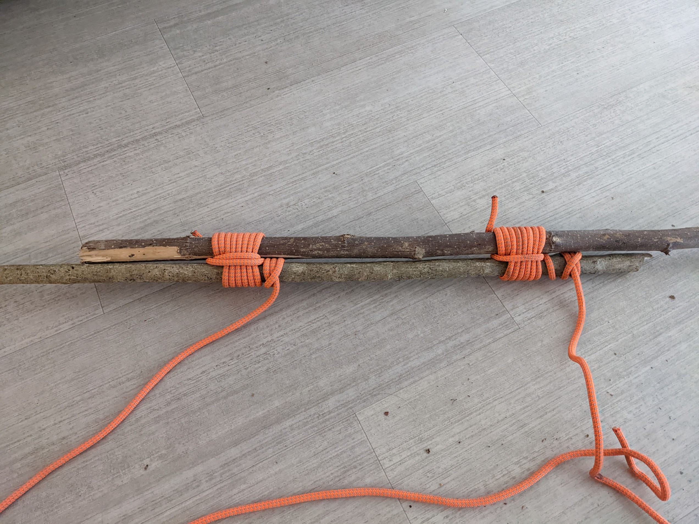
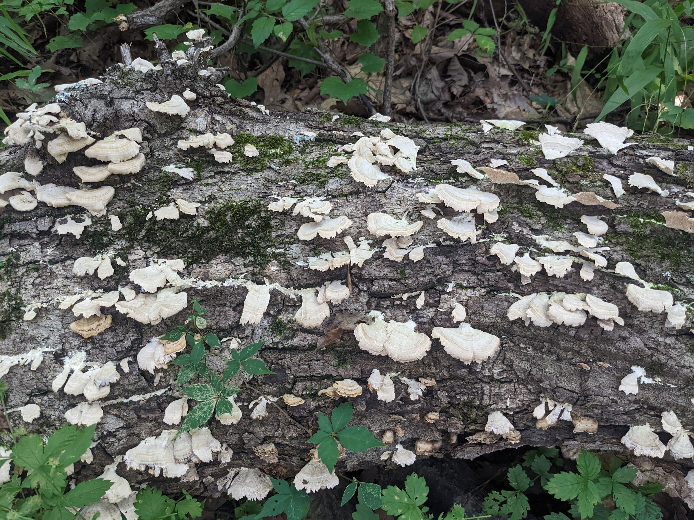
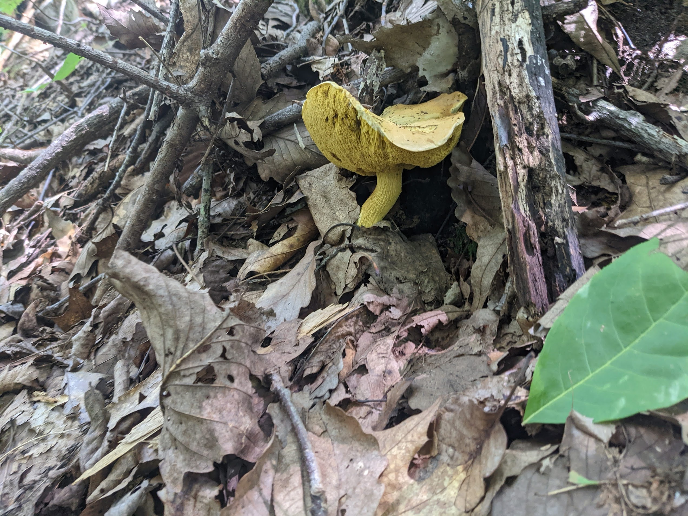

# First Class Rank Requirements

##	CAMPING and OUTDOOR ETHICS
```
1a	Since joining Boy Scouts, participate in 10 separate troop/patrol activities, at least six of which must be held outdoors. Of the outdoor activities, at least three must include overnight camping. These activities do not include troop or patrol meetings. On campouts, spend the night in a tent that you pitch or other structure that you help erect, such as a lean-to, snow cave, or tepee.
```
* ✅ 7/19/2022

**Camp-outs**
- Prentice Cooper - Apr 24 2022
- Mineral Bluff, GA - May 5-9 2022
- Savage Gulf - July 9-10 2022

**Activities**
- Hiking at Signal Mountain - Apr 10 2022
- Hiking at the Smoky Mountains Apr 17 2022
- Hiking - Apr 30 2022
- Cookout and trash cleanup at Prentice Cooper campsite - May 14 2022
- Creek Cleanup - May 15 2022
- Rock climbing and rappelling at Foster Falls - May 21 2022
- Hike Ritchie Hollow trail - May 22 2022
- Rock climbing at Denny Cove - 30 May 2022


```
1b	Explain each of the principles of Tread Lightly! and tell how you practiced them on a campout or outing. This outing must be different from the ones used for Tenderfoot requirement 1c and Second Class requirement 1b.
```

* ✅ 8/9/2022

I paddled out to Maclellan Island, a local bird sanctuary, to hike and attempt to cross the slack line. 

* **Travel Responsibly**  - I used the established boat ramp and pier on the river to avoid impacting the riverbanks. On the island, I stayed on the trails.

* **Respect the rights of others** - On the river, I stayed out of the way of motorized traffic. I left the island before sunset, as the island requires advanced reservations for overnight camping stays.

* **Educate Yourself** - In preparation for my previous camping trip on the island, I learned about the policies applicable to visitors, such as the requirement for camping reservations. I have the appropriate skills to safely paddle on the river, and brought the necessary gear, including water and a life preserver.

* **Avoid Sensitive Areas** - As a bird sanctuary in the middle of an urban river, nearly all of Maclellan island is a sensitive area. I stayed on the trails and did not disturb any of the many birds I saw.

* **Do your part** - I brought a trash bag with me to collect litter. Some litter fall from the overpass that crosses the island, but other litter was left by visitors. I collected about 5 gallons.


##	COOKING
```
2a	Help plan a menu for one of the above campouts that includes at least one breakfast, one lunch, and one dinner and that requires cooking at least two of the meals. Tell how the menu includes the foods from MyPlate or the current USDA nutritional model and how it meets nutritional needs for the planned activity or campout.
```

* ✅ 5/15/2022

*For the Blue Ridge, GA campout:*
| Breakfast |
|---|
| Pancakes, Eggs, Bacon |


| Lunch |
|---|
| Hot Dogs and Brats |

| Dinner |
|---|
| Fajita Tacos |


This menu has foods that are high in protein, making them a good source of energy for an active weekend outdoors. The fajita tacos include a lot of vegetables. *However, the bacon and brats are very high-fat meats, making them a delicious but treacherously easy way to oversupply calories*


```
2b	Using the menu planned in First Class requirement 2a, make a list showing a budget and the food amounts needed to feed three or more boys. Secure the ingredients.
```
* ✅ 5/15/2022

| Food | Quantity | Cost |
| ---- | -------- | ---- |
| Pancake Mix | 1 Box | $4 |
| Syrup | 1 bottle (24 oz) | $3.12 | 
| Butter | 1 stick | $1| 
| Eggs| 1 Dozen | $4.65 for 18 | 
| Bacon | 0.5 lb | $4.88 | 
| | | | 
| Hot Dogs | 8 | $4.22 | 
| Brats | 5 | $5.48 | 
| Hot Dog Buns | 8 | $4.14 for 16 | 
| Ketchup | 1 bottle | $3 | 
| Dijon Mustard | 1 bottle | $3 | 
| | | | 
| Skirt Steak | 2 lb | $9.61 | 
| Onions | 2 | $0.84| 
| Bell Peppers| 6 large| $7.16 | 
| Lime | 2 | 1.44| 
| Tomatoes | 1.5 lb | $2.01 | 
| Jalepenos | 2 | $0.23| 
| Teriyaki Marinade | 1 bottle (16 oz)| $3.37 | 
| Tortillas | 10+ | $3.63| 
| Shredded Cheese| 1 cup| $5 for 2 cups| 
| Grilling Foil | 1 roll | $4.58 | 
| | | | 

```
2c	Show which pans, utensils, and other gear will be needed to cook and serve these meals.
```

* ✅ 8/9/2022


```
2d	Demonstrate the procedures to follow in the safe handling and storage of fresh meats, dairy products, eggs, vegetables, and other perishable food products. Show how to properly dispose of camp garbage, cans, plastic containers, and other rubbish.
```

* ✅ 8/27/2022

* Perishable food must be kept cold with ice in a cooler. Keep the cooler out of direct sunlight.
* Raw meats should be kept in fully-sealed containers. Clean any tools that touch raw meat (i.e. knives, cutting boards) to avoid cross-contamination.

* Keep the campsite clean by promptly collecting trash into a trash bag. Secure the trash bag from animals overnight within a vehicle, locker, or by suspending it from a tree with a hanging line.

```
2e	On one campout, serve as cook. Supervise your assistant(s) in using a stove or building a cooking fire. Prepare the breakfast, lunch, and dinner planned in First Class requirement 2a. Supervise the cleanup.
```

* ✅ 8/27/2022

While camping in Blue Ridge, I cooked breakfast (pancakes), lunch (sausages), and dinner (fajitas). I taught John how to cook over a campfire.


## TOOLS
```
3a	Discuss when you should and should not use lashings.
```
* ✅ 8/27/2022
Lashings are complex knots that are useful for securing wooden poles together. They can be used to assemble shelter, ladders, and other structures.

Some situations where you *could* use lashings, but *shouldn't*, include cases where there aren't enough dead, fallen poles available to build with. Cutting down healthy trees for poles is incompatible with Leave No Trace.

```
3b	Demonstrate tying the timber hitch and clove hitch.
```
* ✅ 8/27/2022


```
3c	Demonstrate tying the square, shear, and diagonal lashings by joining two or more poles or staves together.
```
* ✅ 8/17/2022





```
3d	Use lashings to make a useful camp gadget or structure.
```

##	NAVIGATION
```
4a	Using a map and compass, complete an orienteering course that covers at least one mile and requires measuring the height and/or width of designated items (tree, tower, canyon, ditch, etc.)
```

* ✅ 6/04/2022 

I completed the permanent course at Red Top Mountain state park in 1 hour, 13 minutes.

As far as I can tell, measuring objects is not part of most orienteering courses. Instead I measured the length of the course, which I estimate to be 2,200 meters.

*This was surprisingly fun! The course got more challenging as it went, and I missed markers 8 and 10 and had to backtrack to find them.*


```
4b	Demonstrate how to use a handheld GPS unit, GPS app on a smartphone or other electronic navigation system. Use a GPS to find your current location, a destination of your choice, and the route you will take to get there. Follow that route to arrive at your destination.
```

* ✅ 8/27/2022

This is very straightforward with the Google Maps app.


##	NATURE
```
5a	Identify or show evidence of at least 10 kinds of native plants found in your local area or campsite location. You may show evidence by identifying fallen leaves or fallen fruit that you find in the field, or as part of a collection you have made, or by photographs you have taken.
```
* ✅ 8/17/2022

* Jackson’s Slender (Amanita jacksonii)

* Indigo Milk Cap





* "Parasol" mushroom - species unknown


* Possibly *Amanita flavoconia* 

* Chanterelle 


```
5b	Identify two ways to obtain a weather forecast for an upcoming activity. Explain why weather forecasts are important when planning for an event.
```

* ✅ 8/27/2022

Weather forecasts are published online, on TV, on the radio, and in newspapers.

Some activities are unsuitable for some weather conditions, such as boating in intense winds or hiking in extreme heat. Many mountainous hiking trails are closed after rain, to protect the landscape from erosion. 

```
5c	Describe at least three natural indicators of impending hazardous weather, the potential dangerous events that might result from such weather conditions, and the appropriate actions to take.
```

* ✅ 8/27/2022

* **Storms** - When low, puffy cumulus clouds swell and darken into cumulonimbus clouds, it can indicate upcoming storms with the potential for strong winds. Check that any shelter structure is prepared for wind.

* **Lightning** - Often, lightning can be seen approaching. Each second between seeing lightning and heading thunder indicates one mile distance from the strike. Stay away from peaks, ridges, and isolated trees or other structures to avoid being near a strike.

* **Tornadoes** - Tornadoes typically form from very dark clouds in storms with heavy rain, hail, or strong winds. Tornadoes have a distinctive roaring sound. Be prepared to take immediate shelter from possible flying debris.


```
5d	Describe extreme weather conditions you might encounter in the outdoors in your local geographic area. Discuss how you would determine ahead of time the potential risk of these types of weather dangers, alternative planning considerations to avoid such risks, and how you would prepare for and respond to those weather conditions.
```
* ✅ 8/28/2022

Tennessee is at risk of tornadoes, especially in afternoons and evenings in April through June. When meteorologists forecast weather conditions that indicate a risk of tornado formations, they publish a tornado watch. If wind patterns that indicate formation are actually observed, they publish a tornado warning.

Tornado warnings are disseminated as a emergency broadcast alert to mobile phones. 

The primary danger of injury from a tornado is laceration by wind-thrown debris. Take shelter in an indoor room on the bottom floor of a building, away from any glass, until weather conditions calm down. In my case, I would move from my apartment to the leasing office downstairs.


##	AQUATICS
```
6a	Successfully complete the BSA swimmer test.
```

* ✅ 5/28/2022 

Completed while swimming with Alejandro at Red Bank public pool.


```
6b	Tell what precautions must be taken for a safe trip afloat.
```

✅ 8/28/2022

* **Qualified Supervision** and **Discipline** - Monitor and supervise any children.
* **Health Review** and **Swimming Ability** - Everyone should have the ability to swim in the expected water conditions.
* **Proper Equipment**, including **Life jackets** - All equipment should be available and in good condition, including safety equipment such as rescue lines and life jackets. Wear the life jacket.
* Use a **Buddy System** on the water
* Share a **Plan** with others who can provide assistance if an emergency arises
* Everyone, including passengers, should have the **Skill Proficiency** to handle the craft and respond to emergency situations.


```
6c	Identify the basic parts of a canoe, kayak, or other boat. Identify the parts of a paddle or an oar.
```
* ✅ 7/22/2022 


```
6d	Describe proper body positioning in a watercraft, depending on the type and size of the vessel. Explain the importance of proper body position in the boat.
```

* ✅ 7/22/2022 
 
 In all paddled watercraft, keep your center of gravity low and don't lean too far to either side. This reduces the risk of falling overboard and/or capsizing.

 In a canoe or kayak, sit or kneel facing forward. If only one person is paddling, they should be in the rear, to make steering easier.

 In a rowboat, sit facing backwards. This enables rowing by pulling the oar, which is more efficient than pushing.


```
6e	With a helper and a practice victim, show a line rescue both as tender and rescuer. 
(The practice victim should be approximately 30 feet from shore in deep water.)
```

* ☑️ 9/21/2024

I participated in a real-life swimming rescue at Es Pontas, Mallorca, Spain. The precautions about water safety I learned from this project may well have saved lives that day.


##	FIRST AID AND EMERGENCY PREPAREDNESS
```
7a	Demonstrate bandages for a sprained ankle and for injuries on the head, the upper arm, and the collarbone.
```
* ✅ 1/13/2023

* Sprained Ankle: Wrap with cloth for mild compression. If available, ice and elevate the limb to reduce swelling.


* Head injury: For lacerations, compress with a clean cloth to reduce blood loss. 


* Arm, shoulder, collarbone: Support with an arm sling or splint
 


```
7b	By yourself and with a partner, show how to:
	Transport a person from a smoke-filled room
	Transport for at least 25 yards a person with a sprained ankle.
```

```
7c	Tell the five most common signals of a heart attack.
    Explain the steps (procedures) in cardiopulmonary resuscitation (CPR).
```
* ✅ 1/13/2023

**Signs of a heart attack**:  
* Chest pain or pressure
* Sweating
* Nausea
* Shortness of breath
* Weakness

**Steps in CPR**:
* Call 911, or direct a specific person nearby to do so.
* If an AED is immediately available, use it
* Give 30 fast chest compressions
* Tilt the victim's head back and give 2 rescue breaths
* Repeat alternating chest compressions and rescue breaths until victim is responsive, help arrives, or exhaustion.


```
7d	Tell what utility services exist in your home or meeting place. Describe potential hazards associated with these utilities, and tell how to respond in emergency situations.
```
* ✅ 1/13/2023
**Electricity**
* Signs of uncontained electricity include exposed wiring, sparks, and heat or smoke. Electricity can be disconnected with using a breaker panel, which has a master switch at the top.

**Water** 
* Water can quickly do significant water to buildings. Some fixtures, such as sinks and toilets, have shutoff valves, typically near the floor level. Buildings will also have a shutoff valve that is usually located outside, such as a curbside underground vault. Tools (i.e. a wrench) may be required to access or operate these valves.

```
7e	Develop an emergency action plan for your home that includes what to do in case of fire, storm, power outage, and water outage.
```
* ✅ 1/13/2023

* **Fire**: Evacuate the building via the West stairs.

* **Severe Storm**: Shelter in the ground-floor lobby mail room or bathroom.

* **Power Outage**: Retrieve flashlights from utility room. Refrain from opening the refrigerator or freezer. If required, charge phone using alkaline battery pack.

* **Water outage**: Retrieve water from the nearby Tennessee river; filter it using backpacking equipment and store in water bottles. 


```
7f	Explain how to obtain potable water in an emergency.
```

* ✅ 8/17/2022

* **Boiling** - Filter the water through clean fabric to remove solids, then boil for at least one minute.
* **Filtering** - Pass water through a membrane or UV filter to kill / remove biological contaminants.
* **Chemical Purification** - Mix water with treatment tablets in accordance with printed instructions.


##	FITNESS
```
8a	After completing Second Class requirement 7a, be physically active at least 30 minutes every day for five days a week for four weeks. Keep track of your activities.
```

* ✅ 8/08/2022 

See [this log sheet](./physical-activity/First-Class.md)


```
8b	Share your challenges and successes in completing First Class requirement 8a. Set a goal for continuing to include physical activity as part of your daily life.
```

* ✅ 8/17/2022

I live a fairly active lifestyle, particularly with regular walking and hiking trips. I'm going to continue hiking difficult hikes in preparation for my trip to the Grand Canyon this fall. 

However, I'm also starting a weekly routine of upper-body weight workouts on weeknights. This should help build my strength for rock climbing and paddling.


##	CITIZENSHIP
```
9a	Visit and discuss with a selected individual approved by your leader (for example, an elected official, judge, attorney, civil servant, principal, or teacher) the constitutional rights and obligations of a U.S. citizen.
```

* ✅ November 2022

I discussed the 2022 elections with my father, who is an election judge. We discussed the importance of voting, especially in local races and primary elections. Also, we discussed the mechanisms and procedures that protect the integrity of our election system.

```
9b	Investigate an environmental issue affecting your community. Share what you learned about that issue with your patrol or troop. Tell what, if anything, could be done by you or your community to address the concern.
```

* ✅ 6/04/2022 

I discussed the city of Chattanooga's recycling program with the director of Green Steps, a local environmental nonprofit. I learned that most of the city's mixed-stream recycling is sent directly to the landfill, and the city pays more money per-ton of waste to process recyclables, despite them ending up in the same place.

Green Steps is involved in a project to raise awareness about the inefficacy of single-stream recycling and to encourage people to separate cans and bottles (which can be recycled) from all other plastics, which aren't recycled.

```
9c	On a Scouting or family outing, take note of the trash and garbage you produce. Before your next similar outing, decide how you can reduce, recycle, or repurpose what you take on that outing, and then put those plans into action. Compare your results.
```

* ✅ 6/1/2022 


This isn't a huge amount of trash for 3 people on a day hike, but the bottles and cans are unnecessary. On my next trips, I'll stick to gatorade powder rather than canned drinks.


On the second weekend in a row climbing, I had less trash to pack out. I didn't take any canned or bottled drinks.


```
9d	Participate in three hours of service through one or more service projects approved by your Scoutmaster. The project(s) must not be the same service project(s) used for Tenderfoot requirement 7b and Second Class requirement 8e. Explain how your service to others relates to the Scout Law.
```
✅ 6/9/2025

- Cemetery flags (1.5 hours)  
		- I placed flags at the graves of military veterans for Memorial Day. This reflects the Scout virtue of reverence.

- Trash cleanup for Green steps in downtown Chattanooga (1 hour)  
		- I cleaned up trash around downtown Chattanooga to help keep the city clean, and to protect the environment from the impacts of plastic pollution.

- Blood donation (0.5 hour)
		- By donating blood, I helped contribute to other people's health, safety, and medical research.

##	LEADERSHIP
```
10	Tell someone who is eligible to join Boy Scouts, or an inactive Boy Scout, about your Scouting activities. Invite him to an outing, activity, service project or meeting. Tell him how to join, or encourage the inactive Boy Scout to become active. Share your efforts with your Scoutmaster or other adult leader.
```
* ✅ 5/28/2022 

I discussed this project with Alejandro R on 5/28. He has previously come on a service project with me: the creek cleanup. He seemed unenthusiastic about the prospect of taking a project like this himself.

##	SCOUT SPIRIT
```
11	Demonstrate scout spirit by living the Scout Oath and Scout Law. Tell how you have done your duty to God and how you have lived four different points of the Scout Law (different from those points used for previous ranks) in your everyday life.
```

LOYAL. Show that you care about your family, friends, Scout leaders, school, and country.

KIND. Treat others as you want to be treated. Never harm or kill any living thing without good reason.

BRAVE. Face difficult situations even when you feel afraid. Do what you think is right despite what others might be doing or saying.

REVERENT. Be reverent toward God. Be faithful in your religious duties. Respect the beliefs of others.


```
12	While working toward the First Class rank, and after completing Second Class requirement 11, participate in a Scoutmaster conference.
```

```
13	Successfully complete your board of review for the First Class rank.
```
