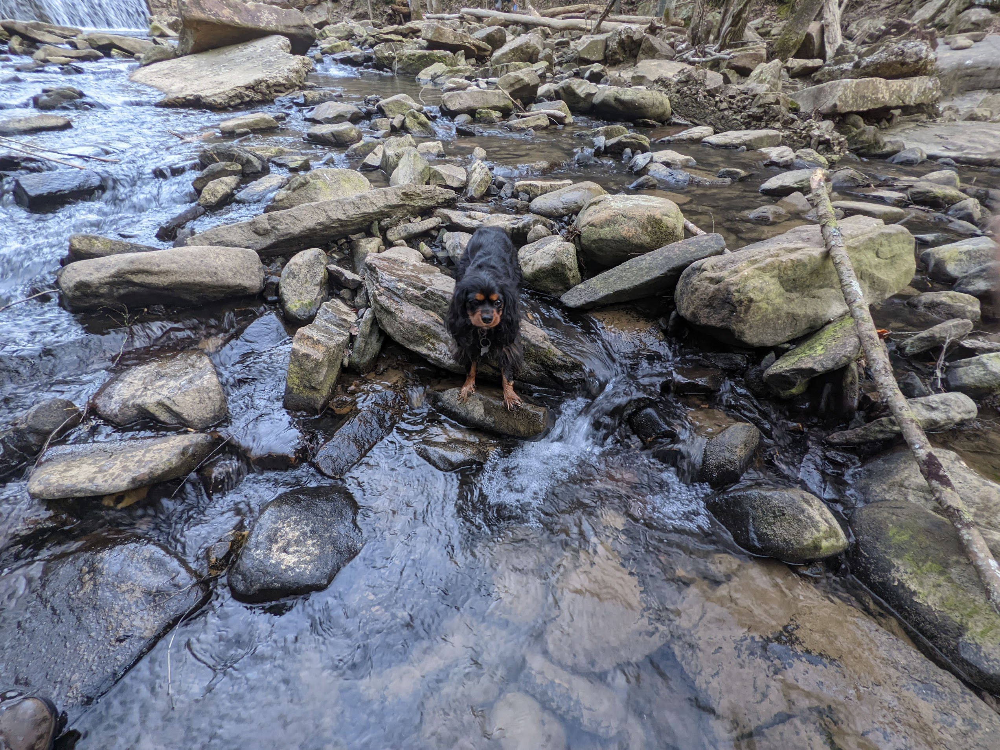
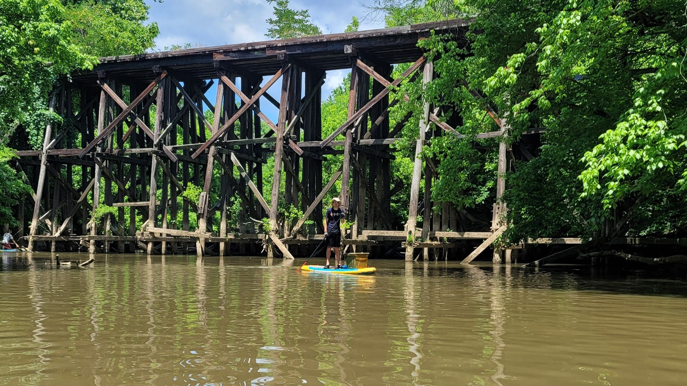

# Activity Log

April 10

Hike at Signal Mountain/ Rainbow Falls with both Alejandros. 2.6 miles.

April 17

Visit to Smoky Mountains National Park with Alejandro R, Peter, and Kaya. Hiked Clingman's Dome trail, approx 1.1 miles + various shorter side-trails.

May 14

Drove out to Prentice Cooper Primitive Campsite and picked up trash from the campsite, trails, and nearby trail-head parking lot. I filled my trunk, plus another bag in my back seat. 1 hour of service work (excluding travel).

May 15

Trash cleanup at Chattanooga Creek - 3 hours of service

May 21

Rock climbing and rappelling with Alejandro R, Alejandro M, Aron, and Arthur. We ran out of water and had to cut the hike short in the heat.

May 22

Hike up Ritchie hollow trail to Pot Point loop, then to Natural Bridge and back. Saw the waterfall along the way. Approximately 7 miles hiked.

May 28

Volunteered at Chattanooga National Cemetary placing flags at the gravestones of military service members alongside a large number of Scouts. 1.5 hours of volunteer service.

May 29

Rock climbing and rappelling at Foster Falls with Schane and Stacy. I climbed 4 routes, including *Ruben*, *Saturated*, and a very tall route that offers a view over the entire valley. We also rappelled down the falls pool wall again.

May 30

More rock climbing, at Denny Cove with Stacy this time. I saw a turtle (tortoise?) on the trail. Weather was beautiful. 

June 19

Kayaking With Eli in Oconomowoc

June 24  

Hiking at Devil's Lake, WI  

June 25  

Kayaking in Oconomowoc with Mom  

July 2   

Swimming/boating on Lake Allatoona  

July 4  

Hiked to and swam in the Blue Hole on Rock Creek

July 17  

Rafting on the Hiwassee river
