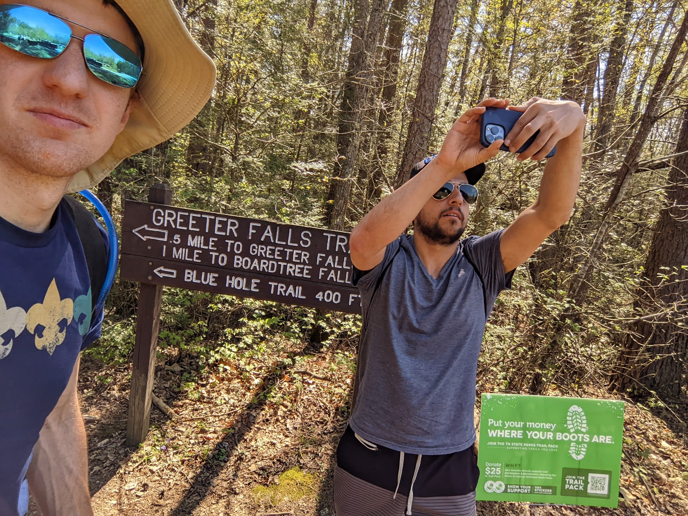
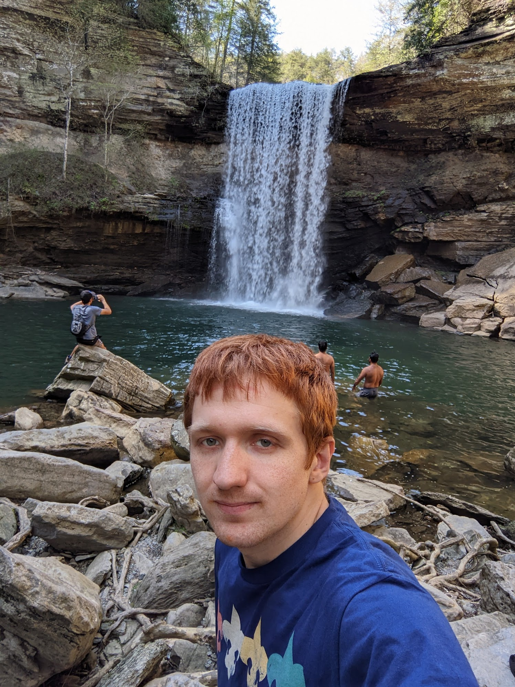
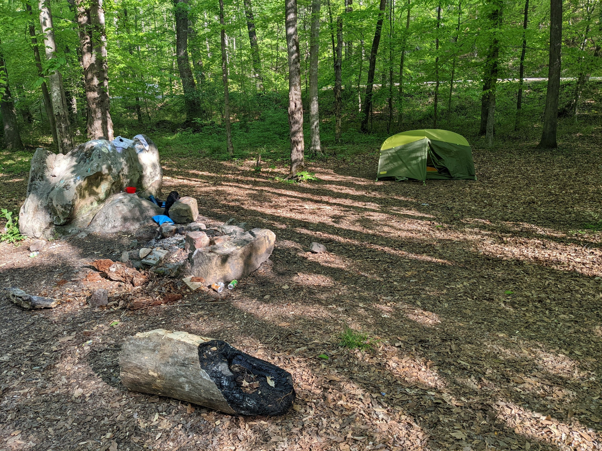
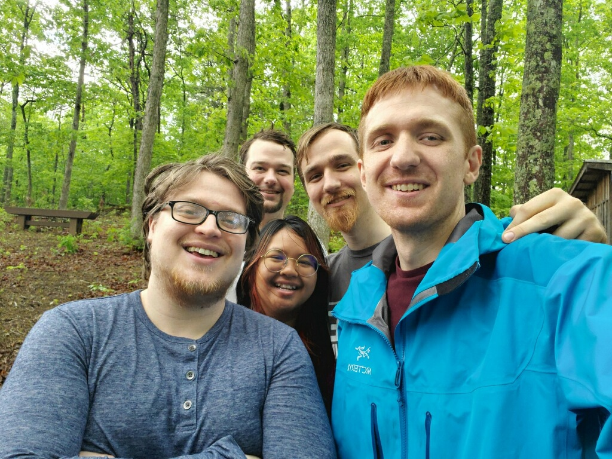
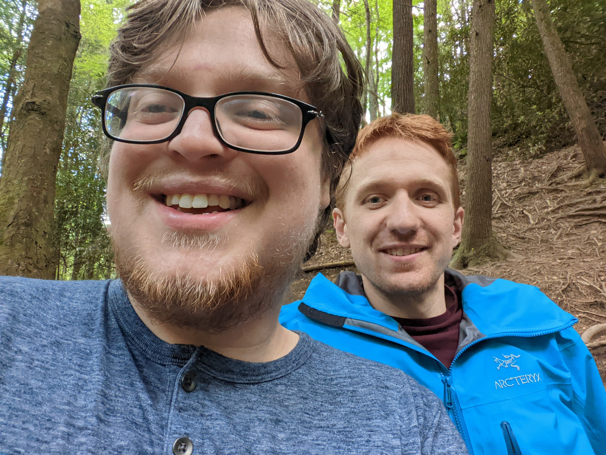
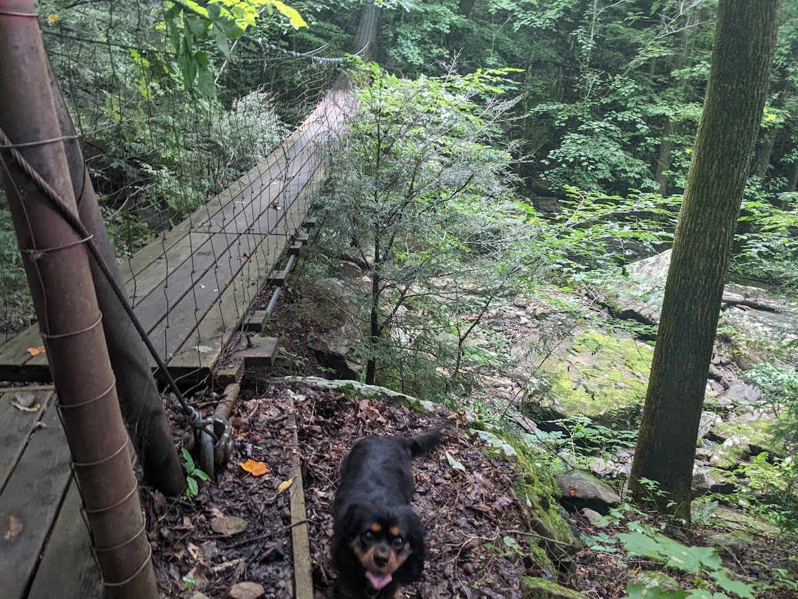
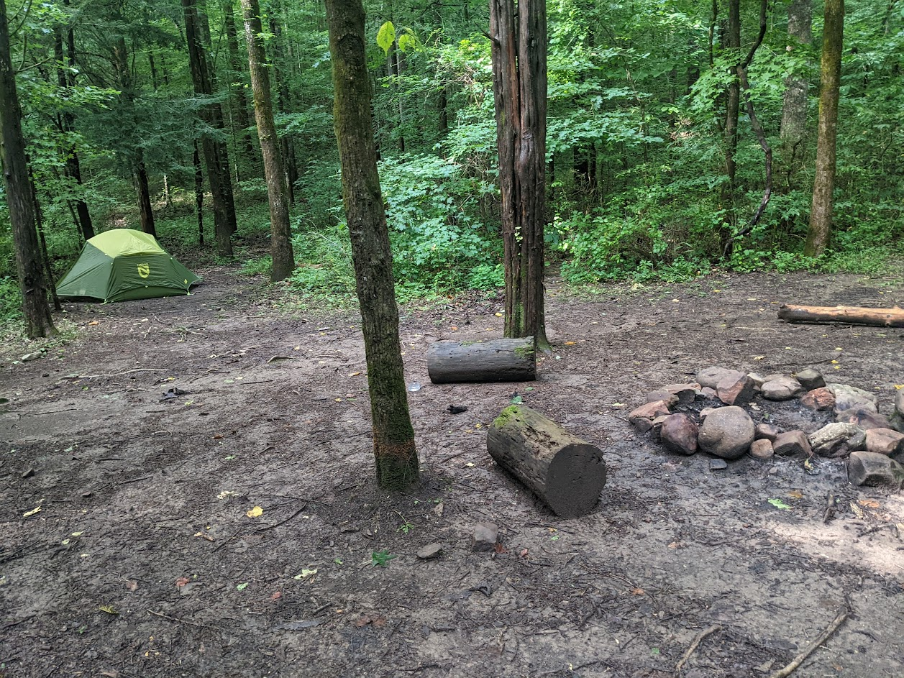

# Camping Events

## April 23-24 2022

Hiking and swimming (in cold water!) at Greeter falls with Alejandro M, Maggie, Peter, and Idin (and of course Cooper). 

Then I went camping at the Prentice Cooper primitive campsite and just barely got my tent set up before dark fell. I started a fire with some generous assistance from a splash of kerosene.

There was a lot of trash around the site, so I picked up two garbage bags of trash.

## May 5-9 2022

The long-awaited camping trip with Lee, Phillip, Dee, and John. We relaxed on a North Georgia mountaintop for 4 nights.

# July 9-10

One-night backpacking trip out to Sawmill Camp in Savage Gulf

# July 23-24

Camped out at the Wolf Creek Falls trailhead near Hot Springs, NC

# August 6-7

Camped out at Prentice Cooper Primitive Campsite with Freddy, Brandon, and Jimmy.
